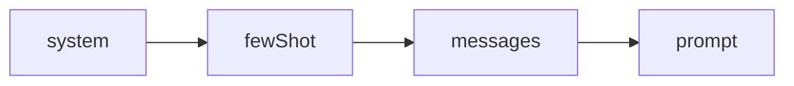
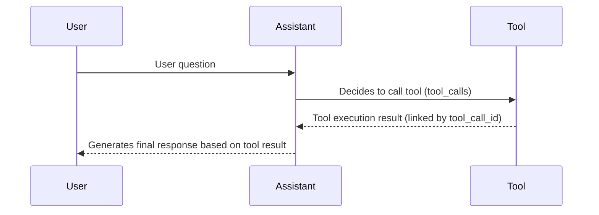

Messages are the fundamental unit of model interaction in deepseek-kit. Every time you call the model, you're constructing a set of messages — the user's question, the assistant's response, the system's instructions, the tool's execution result. Understanding the structure and usage of messages is the foundation for building any AI application. deepseek-kit uses a message format compatible with the DeepSeek API while providing shorthand methods like `prompt` and `system`, enabling you to efficiently organize input in any scenario.

## Prompt Methods

deepseek-kit supports three ways to pass input to the model, suitable for different scenarios:

### Text Prompt

The simplest approach — pass a string directly as user input:

```ts
import { createModel, generateText } from 'deepseek-kit'

const model = createModel({ model: 'deepseek-v4-flash' })

const result = await generateText({
  model,
  prompt: 'Explain the basic principles of quantum computing in three paragraphs.',
})
```

You can also use template literals to inject dynamic data:

```ts
const result = await generateText({
  model,
  prompt: `I'm planning a trip to ${destination} for ${days} days. Please recommend the best activities.`,
})
```

### System Prompt

Use the `system` parameter to set the model's role and behavioral guidelines. The system prompt is sent as the first `system` message to the model, guiding it to respond in a specific way:

```ts
const result = await generateText({
  model,
  system: 'You are a travel planning assistant. Always provide detailed itinerary suggestions, including schedules and cost estimates.',
  prompt: 'I'm planning a 5-day trip to Tokyo. Please recommend an itinerary.',
})
```

The system prompt can be combined with either `prompt` or `messages`:

```ts
const result = await generateText({
  model,
  system: 'You are a research assistant. Always cite sources and provide detailed explanations.',
  prompt: 'What are the basic principles of quantum entanglement?',
})
```

### Message List

When you need to maintain multi-turn conversation history, use the `messages` array. Each message contains `role` and `content` fields:

```ts
const result = await generateText({
  model,
  messages: [
    { role: 'user', content: 'Hello!' },
    { role: 'assistant', content: 'Hello! How can I help you?' },
    { role: 'user', content: 'Where is the best currywurst in Berlin?' },
  ],
})
```

::callout{icon="lucide:info"}
`prompt` and `messages` are mutually exclusive input methods. `prompt` is suitable for single requests, while `messages` is for multi-turn conversations. `system` and `fewShot` can be combined with either.
::

## Message Assembly Order

When you use `system`, `fewShot`, `messages`, and `prompt` together, deepseek-kit assembles them into the final message array in a fixed order:



**system → fewShot → messages → prompt**

```ts
const result = await generateText({
  model,
  system: 'You are a translation assistant.',
  fewShot: [
    { role: 'user', content: 'Hello' },
    { role: 'assistant', content: '你好' },
  ],
  messages: [
    { role: 'user', content: 'Good morning' },
    { role: 'assistant', content: '早上好' },
  ],
  prompt: 'Thank you',
})
```

The final message array sent to the model is:

```ts
[
  { role: 'system', content: 'You are a translation assistant.' },  // system
  { role: 'user', content: 'Hello' },                               // fewShot
  { role: 'assistant', content: '你好' },                            // fewShot
  { role: 'user', content: 'Good morning' },                        // messages
  { role: 'assistant', content: '早上好' },                          // messages
  { role: 'user', content: 'Thank you' },                           // prompt
]
```

Each parameter has a distinct role:

| Parameter | Role | Position |
|-----------|------|----------|
| `system` | Sets the model's role and behavioral guidelines | First, as a `system` message |
| `fewShot` | Provides example conversations to guide the model's response style | After `system`, before `messages` |
| `messages` | Carries multi-turn conversation history | After `fewShot`, before `prompt` |
| `prompt` | The current user input as a single string | Last, as a `user` message |

::callout{icon="lucide:info"}
`system` and `fewShot` are configuration-level inputs — they define **how** the model should behave. `messages` and `prompt` are conversation-level inputs — they define **what** the model should respond to. `prompt` and `messages` are mutually exclusive.
::

## Message Types

deepseek-kit defines four message types, corresponding to different roles in a conversation:

### SystemMessage

Sets the model's behavioral guidelines and role positioning, sent before the conversation begins:

```ts
{ role: 'system', content: 'You are a professional code review assistant.' }
```

Optional fields:

- `name` — Participant name, used to distinguish different sources of system instructions

```ts
{ role: 'system', content: 'Please respond in English.', name: 'language_config' }
```

It's recommended to use the `system` parameter rather than manually adding system messages in `messages` — it's clearer and safer.

### UserMessage

Represents the user's input — the most commonly used message type:

```ts
{ role: 'user', content: 'Please explain what a closure is.' }
```

Optional fields:

- `name` — User identifier, used in multi-user scenarios

```ts
{ role: 'user', content: "How's the weather today?", name: 'alice' }
```

### AssistantMessage

Represents the model's response. Assistant messages can contain text content, tool calls, and reasoning content:

**Plain text response:**

```ts
{ role: 'assistant', content: 'A closure is a function that can access variables from its lexical scope, even when the function is executed outside that scope.' }
```

**Response with tool calls:**

```ts
{
  role: 'assistant',
  content: null,
  tool_calls: [
    {
      id: 'call_abc123',
      type: 'function',
      function: {
        name: 'getWeather',
        arguments: '{"city":"Beijing"}',
      },
    },
  ],
}
```

**Response with reasoning content (thinking mode):**

```ts
{
  role: 'assistant',
  prefix: true,
  reasoning_content: 'The user is asking about the weather, I need to call the weather tool to get real-time data...',
  content: 'Let me check the weather in Beijing for you.'
}
```

When the model has thinking mode enabled, the `reasoning_content` field contains the model's reasoning process, and `content` contains the final response.

### ToolMessage

Represents the result of a tool execution, associated with the corresponding tool call via `tool_call_id`:

```ts
{
  role: 'tool',
  tool_call_id: 'call_abc123',
  content: '{"success":true,"data":{"city":"Beijing","temperature":22,"condition":"Sunny"}}'
}
```

The `tool_call_id` must match the `id` of the corresponding item in the `AssistantMessage`'s `tool_calls` array for the model to correctly associate the tool call with its result.

## Multi-Turn Conversations

Use the `messages` array to build multi-turn conversations, where each turn contains a user message and an assistant message:

```ts
import { createAgent, createModel } from 'deepseek-kit'

const model = createModel({ model: 'deepseek-v4-flash' })

const agent = createAgent({ model })

const result = await agent.generate({
  messages: [
    { role: 'user', content: 'What is machine learning?' },
    { role: 'assistant', content: 'Machine learning is a branch of artificial intelligence that enables computers to learn patterns from data without being explicitly programmed.' },
    { role: 'user', content: 'How does it differ from deep learning?' },
  ],
})

console.log(result.text)
```

## Tool Calling Message Flow

When an agent calls a tool, the message flow follows a fixed pattern:



```ts
const messages = [
  { role: 'user', content: 'How\'s the weather in Beijing today?' },
  {
    role: 'assistant',
    content: null,
    tool_calls: [{
      id: 'call_001',
      type: 'function',
      function: { name: 'getWeather', arguments: '{"city":"Beijing"}' },
    }],
  },
  {
    role: 'tool',
    tool_call_id: 'call_001',
    content: '{"success":true,"data":{"city":"Beijing","temperature":22,"condition":"Sunny"}}',
  },
  {
    role: 'assistant',
    content: 'Beijing is sunny today, 22°C, humidity 60%.',
  },
]
```

::callout{icon="lucide:info"}
In agent mode, you don't need to manually construct the tool calling message flow. `createAgent` automatically handles the generation and association of AssistantMessages and ToolMessages.
::

## Manually Constructing Conversation History

In some scenarios, you may need to manually construct conversation history — for example, loading history from a database or simulating a specific conversation context:

```ts
import { createModel, generateText, tool } from 'deepseek-kit'
import { z } from 'zod'

const model = createModel({ model: 'deepseek-v4-flash' })

const weatherTool = tool({
  name: 'getWeather',
  description: 'Query city weather',
  schema: z.object({ city: z.string() }),
  execute: async input => `${input.city}: Sunny, 22°C`,
})

const result = await generateText({
  model,
  tools: [weatherTool],
  messages: [
    { role: 'system', content: 'You are a weather assistant.' },
    { role: 'user', content: 'How\'s the weather in Beijing?' },
    {
      role: 'assistant',
      content: null,
      tool_calls: [{
        id: 'call_prev_001',
        type: 'function',
        function: { name: 'getWeather', arguments: '{"city":"Beijing"}' },
      }],
    },
    {
      role: 'tool',
      tool_call_id: 'call_prev_001',
      content: '{"success":true,"data":{"city":"Beijing","temperature":22,"condition":"Sunny"}}',
    },
    { role: 'assistant', content: 'Beijing is sunny today, 22°C.' },
    { role: 'user', content: 'What about Shanghai?' },
  ],
})
```

## Choosing Between prompt and messages

| Feature | `prompt` | `messages` |
|---------|---------|-----------|
| Input method | Single string | Message array |
| Use case | Single requests, stateless generation | Multi-turn conversations, stateful interactions |
| System prompt | Via `system` parameter | Via `system` parameter or `system` message |
| Few-shot examples | Via `fewShot` parameter | Via `fewShot` parameter or included in `messages` |
| Tool call history | Not supported | Supported |
| Conversation continuity | None | Fully preserved |

Recommendations:

- **One-off generation** — Use `prompt`, e.g., content creation, data extraction
- **Chat applications** — Use `messages`, e.g., customer service conversations, interactive Q&A
- **Historical context needed** — Use `messages`, e.g., follow-up questions, multi-step reasoning

## API Reference

### ChatMessage Types

::field-group
  ::field{name="SystemMessage" type="{ role: 'system', content: string, name?: string }"}
  System message. Sets the model's behavioral guidelines and role positioning.
  ::

  ::field{name="UserMessage" type="{ role: 'user', content: string, name?: string }"}
  User message. Represents the user's input.
  ::

  ::field{name="AssistantMessage" type="{ role: 'assistant', content: string | null, tool_calls?: ChatCompletionTool[], reasoning_content?: string }"}
  Assistant message. Represents the model's response, which may contain text, tool calls, and reasoning content.
  ::

  ::field{name="ToolMessage" type="{ role: 'tool', content: string, tool_call_id: string }"}
  Tool message. Represents the tool execution result, linked to the corresponding tool call via `tool_call_id`.
  ::
::

### ChatCompletionTool Type

::field-group
  ::field{name="id" type="string"}
  Unique identifier for the tool call. Used to associate the tool execution result with the call request.
  ::

  ::field{name="type" type="'function'"}
  Tool call type. Currently only `'function'` is supported.
  ::

  ::field{name="function.name" type="string"}
  Name of the tool being called.
  ::

  ::field{name="function.arguments" type="string"}
  Tool call arguments, in JSON string format.
  ::
::

### Input Parameters

::field-group
  ::field{name="prompt" type="string"}
  Text prompt. Sent as a single user message to the model. Mutually exclusive with `messages`.
  ::

  ::field{name="system" type="string"}
  System prompt. Sent as the first system message to the model. Can be combined with `prompt` or `messages`.
  ::

  ::field{name="fewShot" type="ChatMessage[]"}
  Few-shot example messages. Inserted after the `system` message and before `messages`. Used to guide the model's response style and format through demonstrations. Can be combined with `prompt` or `messages`.
  ::

  ::field{name="messages" type="ChatMessage[]"}
  Message array. Used to build multi-turn conversations or contexts that include tool call history. Mutually exclusive with `prompt`.
  ::
::
