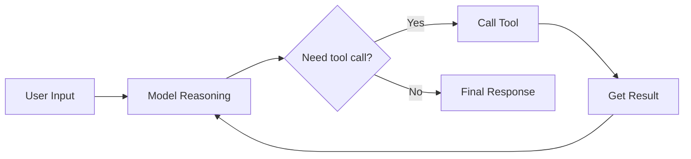

Agents are the most powerful abstraction in deepseek-kit. They combine **models**, **tools**, and **multi-step loops** — the model handles reasoning and decision-making, tools handle interaction with the external world, and the loop ensures continuous execution until a final answer is reached. This pattern is known as ReAct (Reasoning + Acting) and is the core paradigm for building AI applications.

## Creating an Agent

Use `createAgent()` to create an agent. You only need to provide a model instance, and the agent is ready to work:

```ts
import { createAgent, createModel } from 'deepseek-kit'

const model = createModel({ model: 'deepseek-v4-flash' })

const agent = createAgent({ model })

const result = await agent.generate({
  prompt: 'Hello!',
})

console.log(result.text)
```

But the real power of agents lies in tools. When equipped with tools, an agent can autonomously decide when to call tools, how to process results, and continue reasoning until the task is complete:

```ts
import { createAgent, createModel, tool } from 'deepseek-kit'
import { z } from 'zod'

const model = createModel({ model: 'deepseek-v4-flash' })

const weatherTool = tool({
  name: 'getWeather',
  description: 'Query weather information for a city',
  schema: z.object({
    city: z.string().describe('City name'),
  }),
  execute: async (input) => {
    return `${input.city}: Sunny today, 22°C, humidity 60%.`
  },
})

const agent = createAgent({
  model,
  tools: [weatherTool],
})

const result = await agent.generate({
  prompt: 'How\'s the weather in Chongqing today?',
})

console.log(result.text)
```

## How Agents Work

Agents follow the ReAct loop:

1. **Reason** — The model analyzes the user input and current context, deciding the next action
2. **Act** — If a tool call is needed, the model generates a tool call; otherwise, it generates a text response directly
3. **Observe** — Tool execution results are added to the conversation as input for the next step
4. **Loop** — Repeat the above steps until the model generates a final response or the maximum number of steps is reached



The maximum number of steps defaults to 50. You can control this via `maxSteps` when creating the agent:

```ts
const agent = createAgent({
  model,
  maxSteps: 10,
})

const result = await agent.generate({
  prompt: 'Complex query',
})
```

## Streaming

Use the `stream()` method to receive the agent's output in real time, including text deltas and tool call events:

```ts
const stream = agent.stream({
  prompt: 'How\'s the weather in Chongqing today?',
})

for await (const event of stream) {
  switch (event.type) {
    case 'text-delta':
      process.stdout.write(event.textDelta)
      break
    case 'tool-call':
      console.log(`\nCalling tool: ${event.toolCalls.map(t => t.function.name).join(', ')}`)
      break
    case 'finish':
      console.log('\nDone!')
      break
  }
}
```

## System Prompt

Use the `system` parameter to set the agent's role and behavioral guidelines, guiding it to respond in a specific way:

```ts
const agent = createAgent({
  model,
  tools: [searchTool],
  system: 'You are a research assistant. Always cite sources and provide detailed explanations.',
})
```

## Few-Shot

Use the `fewShot` parameter to provide example conversations that guide the model's response style and format. Few-shot examples are inserted after the system prompt and before the actual conversation, helping the model learn the desired pattern from demonstrations:

```ts
const agent = createAgent({
  model,
  system: 'You are a translation assistant.',
  fewShot: [
    { role: 'user', content: 'Hello' },
    { role: 'assistant', content: '你好' },
    { role: 'user', content: 'Goodbye' },
    { role: 'assistant', content: '再见' },
  ],
})

const result = await agent.generate({
  prompt: 'Thank you',
})

console.log(result.text) // 谢谢
```

The message order in the final conversation is: **system → fewShot → messages → prompt**.

## Structured Output

Agents can return structured data conforming to a Zod Schema instead of free-form text. This is particularly useful when you need to integrate the agent's output into other systems:

```ts
const agent = createAgent({
  model,
  tools: [weatherTool],
  output: {
    schema: z.object({
      city: z.string(),
      weather: z.string(),
      temperature: z.number(),
      recommendation: z.string(),
    }),
  },
})

const result = await agent.generate({
  prompt: 'How\'s the weather in Beijing? Do I need an umbrella?',
})

console.log(result.output)
// { city: 'Beijing', weather: 'Sunny', temperature: 22, recommendation: 'No umbrella needed.' }
```

## Lifecycle Hooks

Agents support three lifecycle hooks that let you insert custom logic before and after each step — for logging, dynamically modifying messages, adjusting configuration, and handling errors:

```ts
const agent = createAgent({
  model,
  tools: [weatherTool],
  hooks: {
    beforeStep: (context, hookCtx) => {
      console.log(`Step ${context.step} starting, ${context.messages.length} messages`)
    },
    afterStep: (step, hookCtx) => {
      console.log(`Step ${step.step} completed: ${step.type}`)
      if (step.toolCalls) {
        console.log(`  Tool calls: ${step.toolCalls.map(t => t.function.name).join(', ')}`)
      }
    },
    onError: (error, hookCtx) => {
      console.error(`Step error: ${error.type} - ${error.message}`)
    },
  },
})
```

You can also terminate the loop early via `hookCtx.stop()`:

```ts
beforeStep: (context, hookCtx) => {
  if (context.step > 5) {
    hookCtx.stop()
  }
}
```

You can also modify the current step's configuration by returning a config object in `beforeStep`:

```ts
beforeStep: (context, hookCtx) => {
  if (context.step > 5) {
    return {
      config: {
        model: 'deepseek-v4-pro',
      },
    }
  }
}
```

This will cause the agent to switch to the Pro model after step 6.

## API Reference

### Parameters

::field-group
  ::field{name="model" type="DeepSeekModel" required}
  Model instance, serving as the agent's reasoning engine.
  ::

  ::field{name="tools" type="Tool[]"}
  List of available tools. The agent autonomously decides which tools to call based on user input.
  ::

  ::field{name="system" type="string"}
  System prompt for setting the agent's role and behavioral guidelines.
  ::

  ::field{name="fewShot" type="ChatMessage[]"}
  Few-shot example messages, inserted after the system prompt and before the conversation. Used to guide the model's response style and format through demonstrations.
  ::

  ::field{name="output" type="{ schema: ZodSchema }"}
  Structured output schema. When specified, the agent returns structured data conforming to the schema.
  ::

  ::field{name="hooks" type="GenerateTextHooks"}
  Lifecycle hooks, including `beforeStep`, `afterStep`, and `onError`.
  ::

  ::field{name="maxSteps" type="number" defaultValue="50"}
  Maximum number of execution steps. The loop terminates when this limit is reached.
  ::

  ::field{name="signal" type="AbortSignal"}
  Abort signal for canceling an in-progress agent request.
  ::
::

### Methods

::field-group
  ::field{name="generate(params)" type="Promise<GenerateTextResult>"}
  Execute the agent and return the complete result. `params` contains `prompt` or `messages`.
  ::

  ::field{name="stream(params)" type="AsyncGenerator<StreamEvent>"}
  Execute the agent in streaming mode, returning events. Event types include `text-delta`, `reasoning-delta`, `tool-call`, `step`, and `finish`.
  ::
::

### StreamEvent Types

::field-group
  ::field{name="text-delta" type="TextDeltaStreamEvent"}
  Text delta event. Contains the `textDelta` field.
  ::

  ::field{name="reasoning-delta" type="ReasoningDeltaStreamEvent"}
  Reasoning delta event. Contains the `reasoningDelta` field (available when thinking mode is enabled).
  ::

  ::field{name="tool-call" type="ToolCallStreamEvent"}
  Tool call event. Contains `step` and `toolCalls` fields.
  ::

  ::field{name="step" type="StepStreamEvent"}
  Step start event. Contains the `step` field.
  ::

  ::field{name="finish" type="FinishStreamEvent"}
  Finish event. Contains `text` and `usage` fields.
  ::
::
