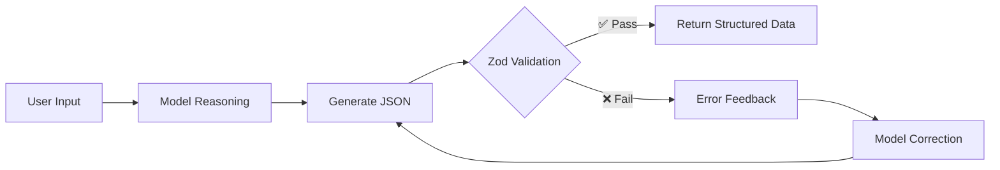

By default, models return free-form text. But in many scenarios, you need structured data — extracting contact information from text, classifying user feedback by sentiment, generating configuration objects in a specific format. deepseek-kit's structured output feature lets you define the expected data structure via a Zod Schema, and the model generates JSON data conforming to that schema, with automatic validation and retry to ensure type-safe results.

## Basic Usage

Specify a Zod Schema via the `output` parameter, and the model will return structured data conforming to that schema:

```ts
import { createAgent, createModel } from 'deepseek-kit'
import { z } from 'zod'

const model = createModel({ model: 'deepseek-v4-flash' })

const agent = createAgent({
  model,
  output: {
    schema: z.object({
      name: z.string().describe('Contact name'),
      email: z.string().describe('Email address'),
      phone: z.string().describe('Phone number'),
    }),
  },
})

const result = await agent.generate({
  prompt: 'Extract contact information: John, john@example.com, 13800138000',
})

console.log(result.output)
// { name: 'John', email: 'john@example.com', phone: '13800138000' }
```

You can also use structured output directly with `generateText`:

```ts
import { createModel, generateText } from 'deepseek-kit'
import { z } from 'zod'

const model = createModel({ model: 'deepseek-v4-flash' })

const result = await generateText({
  model,
  output: {
    schema: z.object({
      sentiment: z.enum(['positive', 'negative', 'neutral']),
      confidence: z.number().min(0).max(1),
    }),
  },
  messages: [{ role: 'user', content: 'This product is amazing, highly recommended!' }],
})

console.log(result.output)
// { sentiment: 'positive', confidence: 0.95 }
```

## How It Works

deepseek-kit's structured output uses a **prompt + JSON mode + automatic retry** strategy:

1. **Build Prompt** — Convert the Zod Schema to JSON Schema and generate a formatting prompt requiring the model to output JSON conforming to the schema
2. **JSON Mode Call** — Call the model with `response_format: { type: 'json_object' }` to ensure the output is valid JSON
3. **Validation Parsing** — Use Zod's `safeParse` to validate whether the model output fully conforms to the schema
4. **Automatic Retry** — If validation fails, format the error information and feed it back to the model for correction and retry



## Combining with Tools

Structured output can be used simultaneously with tools. The agent first calls tools through a multi-step loop to gather information, then generates structured output in the final step:

```ts
import { createAgent, createModel, tool } from 'deepseek-kit'
import { z } from 'zod'

const model = createModel({ model: 'deepseek-v4-flash' })

const weatherTool = tool({
  name: 'getWeather',
  description: 'Query weather information for a city',
  schema: z.object({
    city: z.string().describe('City name'),
  }),
  execute: async (input) => {
    return { city: input.city, temperature: 22, condition: 'Sunny' }
  },
})

const agent = createAgent({
  model,
  tools: [weatherTool],
  output: {
    schema: z.object({
      city: z.string(),
      temperature: z.number(),
      condition: z.string(),
      recommendation: z.string(),
    }),
  },
})

const result = await agent.generate({
  prompt: 'How\'s the weather in Beijing? Do I need an umbrella?',
})

console.log(result.output)
// { city: 'Beijing', temperature: 22, condition: 'Sunny', recommendation: 'No umbrella needed, the weather is clear.' }
```

::callout{icon="lucide:info"}
Structured output generation consumes an additional step. When combined with tools, make sure `maxSteps` is large enough to accommodate both tool calls and the final structured output step.
::

## Property Descriptions

Use `.describe()` to add descriptions to schema properties, helping the model understand the meaning and expected format of each field, thereby improving generation quality:

```ts
const agent = createAgent({
  model,
  output: {
    schema: z.object({
      name: z.string().describe('Recipe name'),
      ingredients: z.array(
        z.object({
          name: z.string().describe('Ingredient name'),
          amount: z.string().describe('Quantity, e.g., 200g, 2 tablespoons'),
        }),
      ).describe('Ingredient list'),
      steps: z.array(z.string()).describe('Cooking steps'),
    }),
  },
})

const result = await agent.generate({
  prompt: 'Generate a recipe for scrambled eggs with tomatoes.',
})

console.log(result.output)
```

Property descriptions are especially useful for:

- Disambiguating property names (e.g., is `name` a person's name or a product name?)
- Specifying expected formats or conventions (e.g., date format, numeric range)
- Providing contextual explanations for complex nested structures

## Nested Structures

The schema supports arbitrary levels of nesting, allowing you to define complex data structures:

```ts
const agent = createAgent({
  model,
  output: {
    schema: z.object({
      order: z.object({
        orderId: z.string(),
        customer: z.object({
          name: z.string(),
          address: z.object({
            city: z.string(),
            street: z.string(),
            zipCode: z.string(),
          }),
        }),
        items: z.array(z.object({
          productName: z.string(),
          quantity: z.number().int().positive(),
          price: z.number().positive(),
        })),
        totalAmount: z.number().positive(),
      }),
    }),
  },
})

const result = await agent.generate({
  prompt: 'Parse the order: Order ID ORD-001, customer John, 88 Jianguo Road, Chaoyang District, Beijing 100022, purchased 2 copies of "JavaScript: The Definitive Guide" at $89 each, 1 keyboard at $299 each.',
})

console.log(result.output)
```

## Enums and Union Types

Use Zod's enum and union types to constrain the range of output values:

```ts
const agent = createAgent({
  model,
  output: {
    schema: z.object({
      category: z.enum(['Technology', 'Sports', 'Entertainment', 'Finance', 'Education']),
      priority: z.enum(['high', 'medium', 'low']),
      tags: z.array(z.string()),
    }),
  },
})

const result = await agent.generate({
  prompt: 'Classify this article: OpenAI has released a new generation of large language models...',
})

console.log(result.output)
// { category: 'Technology', priority: 'high', tags: ['AI', 'LLM', 'OpenAI'] }
```

## Optional Fields and Default Values

Use `.optional()` and `.default()` to handle potentially missing fields:

```ts
const agent = createAgent({
  model,
  output: {
    schema: z.object({
      title: z.string(),
      summary: z.string(),
      author: z.string().optional(),
      publishDate: z.string().optional(),
      rating: z.number().min(1).max(5).default(3),
    }),
  },
})

const result = await agent.generate({
  prompt: 'Summarize the main points of this article.',
})
```

## Automatic Retry and Error Handling

When the model generates JSON that doesn't conform to the schema, deepseek-kit automatically retries:

### JSON Parse Failure

If the model outputs invalid JSON, deepseek-kit prompts the model to output valid JSON:

```
Model output: "Here is the result: { "name": "John" }"  ← Contains extra text
Feedback: "Your previous output is not valid JSON. Please output only a valid JSON object..."
```

### Schema Validation Failure

If the JSON is valid but doesn't conform to the schema, deepseek-kit formats the Zod validation errors and feeds them back to the model:

```
Model output: { "rating": 10 }  ← Exceeds 1-5 range
Feedback: "Your previous JSON output does not conform to the required schema...
       - Field 'rating': Number must be less than or equal to 5"
```

The default maximum retry count is 3. If the output still doesn't conform to the schema after reaching the limit, an `AgentError` is thrown:

```ts
import { createAgent, createModel } from 'deepseek-kit'
import { z } from 'zod'

const model = createModel({ model: 'deepseek-v4-flash' })

const agent = createAgent({
  model,
  output: {
    schema: z.object({
      code: z.string().regex(/^[A-Z]{3}-\d{4}$/, 'Format should be XXX-0000'),
    }),
  },
})

try {
  const result = await agent.generate({
    prompt: 'Generate a code.',
  })
}
catch (error) {
  if (error.type === 'schema_error') {
    console.error('Structured output validation failed:', error.message)
  }
}
```

## Structured Data in Streaming

When using the `stream()` method, the structured output generation process is pushed as stream events. You can get the final text result in the `finish` event:

```ts
const stream = agent.stream({
  prompt: 'Extract contact information: Jane, jane@example.com',
})

for await (const event of stream) {
  switch (event.type) {
    case 'text-delta':
      process.stdout.write(event.textDelta)
      break
    case 'tool-call':
      console.log(`\nCalling tool: ${event.toolCalls.map(t => t.function.name).join(', ')}`)
      break
    case 'step':
      console.log(`\nStep ${event.step}`)
      break
    case 'finish':
      console.log('\nDone!')
      break
  }
}
```

## Lifecycle Hooks

The structured output generation step also triggers lifecycle hooks. In `afterStep`, the step type is `'format'`, which you can use to track the structured output generation process:

```ts
const agent = createAgent({
  model,
  output: {
    schema: z.object({ name: z.string(), email: z.string() }),
  },
  hooks: {
    afterStep: (step) => {
      if (step.type === 'format') {
        console.log(`Structured output step ${step.step} completed`)
      }
    },
  },
})
```

## API Reference

### output Parameter

::field-group
  ::field{name="schema" type="z.ZodTypeAny" required}
  Zod Schema that defines the structured output format. The model generates JSON data conforming to this schema, which is validated before being returned.
  ::
::

### GenerateTextResult Type

::field-group
  ::field{name="text" type="string"}
  Text content generated by the model. When using structured output, this field contains the raw JSON string.
  ::

  ::field{name="output" type="z.infer<T>"}
  Schema-validated structured output data. The type is automatically inferred from the provided Zod Schema. `undefined` when `output` is not specified.
  ::

  ::field{name="usage" type="Usage"}
  Token usage statistics, including prompt_tokens, completion_tokens, and total_tokens.
  ::
::

### StepEvent Type (Structured Output Step)

::field-group
  ::field{name="step" type="number"}
  Current step number.
  ::

  ::field{name="type" type="'format'"}
  Step type. The structured output step type is `'format'`.
  ::

  ::field{name="usage" type="Usage"}
  Token usage for the current step.
  ::

  ::field{name="text" type="string"}
  Raw text generated in the current step (JSON string).
  ::

  ::field{name="reasoningContent" type="string"}
  Reasoning content (available when thinking mode is enabled).
  ::
::

### AgentError Type (Structured Output Error)

::field-group
  ::field{name="type" type="'schema_error'"}
  Error type. `'schema_error'` when structured output validation fails.
  ::

  ::field{name="message" type="string"}
  Error description, including a summary of the last model output.
  ::

  ::field{name="step" type="number"}
  Step number when the error occurred.
  ::

  ::field{name="retryable" type="false"}
  Whether the error is retryable. Structured output errors are marked as non-retryable.
  ::
::
