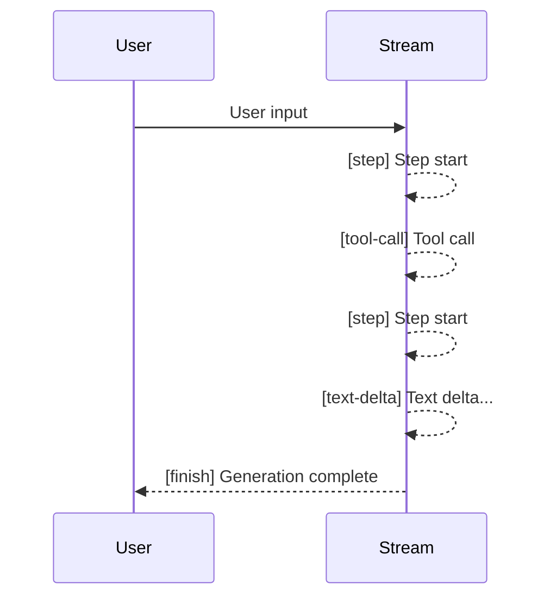

Large language models can take several seconds or even tens of seconds to generate long text. With traditional blocking calls, users can only stare at a loading animation waiting for the complete response. Streaming delivers **generated content incrementally**, allowing users to see the model's output almost in real time, greatly improving the interactive experience. deepseek-kit provides a clean streaming API through `agent.stream()`, supporting multiple event types including text deltas, reasoning deltas, and tool calls.

## Basic Usage

Use `agent.stream()` instead of `agent.generate()` to get streaming output. `stream()` returns an async iterator that you can consume via `for await...of`:

```ts
import { createAgent, createModel } from 'deepseek-kit'

const model = createModel({ model: 'deepseek-v4-flash' })

const agent = createAgent({ model })

const stream = agent.stream({
  prompt: 'Explain the basic principles of quantum computing in three paragraphs.',
})

for await (const event of stream) {
  switch (event.type) {
    case 'text-delta':
      process.stdout.write(event.textDelta)
      break
    case 'finish':
      console.log('\n--- Generation complete ---')
      break
  }
}
```

The `text-delta` event carries a small text increment that you can directly append to the UI for a typewriter-like display effect.

## Stream Event Types

deepseek-kit defines five stream event types, covering all key points in the agent's execution process:

### text-delta — Text Delta

Each time the model generates a small piece of text, a `text-delta` event is triggered. This is the most commonly used event type for displaying the model's text output in real time:

```ts
case 'text-delta':
  process.stdout.write(event.textDelta)
  break
```

### reasoning-delta — Reasoning Delta

When the model has thinking mode enabled, the reasoning process is pushed as `reasoning-delta` events. You can use this to display the model's "thinking process":

```ts
case 'reasoning-delta':
  process.stdout.write(`[Thinking] ${event.reasoningDelta}`)
  break
```

::callout{icon="lucide:info"}
`reasoning-delta` is only available when the model returns the `reasoning_content` field, which requires model and configuration support for thinking mode.
::

### tool-call — Tool Call

When the agent calls a tool, the `tool-call` event is triggered after the tool execution completes, carrying information about all tool calls in that step:

```ts
case 'tool-call':
  console.log(`Step ${event.step} called tools:`)
  for (const tc of event.toolCalls) {
    console.log(`  - ${tc.function.name}(${tc.function.arguments})`)
  }
  break
```

### step — Step Start

Triggered at the beginning of each new step, carrying the step number. You can use it to track the agent's execution progress:

```ts
case 'step':
  console.log(`\n[Step ${event.step}]`)
  break
```

### finish — Generation Complete

Triggered after the agent completes all steps, carrying the final complete text and token usage:

```ts
case 'finish':
  console.log('Generation complete')
  console.log(`Token usage: ${event.usage?.total_tokens}`)
  break
```

## Complete Event Handling

The following example shows how to handle all event types to build a complete streaming output experience:

```ts
import { createAgent, createModel, tool } from 'deepseek-kit'
import { z } from 'zod'

const model = createModel({ model: 'deepseek-v4-flash' })

const weatherTool = tool({
  name: 'getWeather',
  description: 'Query weather information for a city',
  schema: z.object({ city: z.string().describe('City name') }),
  execute: async (input) => {
    return `${input.city}: Sunny today, 22°C.`
  },
})

const agent = createAgent({
  model,
  tools: [weatherTool],
})

const stream = agent.stream({
  prompt: 'How\'s the weather in Beijing today?',
})

for await (const event of stream) {
  switch (event.type) {
    case 'step':
      console.log(`\n=== Step ${event.step} ===`)
      break
    case 'text-delta':
      process.stdout.write(event.textDelta)
      break
    case 'reasoning-delta':
      process.stdout.write(`[Thinking] ${event.reasoningDelta}`)
      break
    case 'tool-call':
      console.log(`\nCalling tool: ${event.toolCalls.map(t => t.function.name).join(', ')}`)
      break
    case 'finish':
      console.log('\n=== Complete ===')
      if (event.usage) {
        console.log(`Total tokens: ${event.usage.total_tokens}`)
      }
      break
  }
}
```

Example output:

```
=== Step 1 ===
Calling tool: getWeather
=== Step 2 ===
Beijing: Sunny today, 22°C.
=== Complete ===
Total tokens: 256
```

## Streaming with Tool Calls

When the agent is equipped with tools, streaming output automatically includes tool call events. The flow works as follows:

1. **Step 1** — The model reasons and decides to call a tool, triggering `step` → `tool-call` events
2. **Step 2** — The model generates a final response based on the tool result, triggering `step` → `text-delta` → `finish` events



You can switch display states in the UI based on event types — showing "Querying..." during tool calls and displaying results incrementally during text deltas:

```ts
for await (const event of stream) {
  switch (event.type) {
    case 'tool-call':
      for (const tc of event.toolCalls) {
        console.log(`🔍 Calling ${tc.function.name}...`)
      }
      break
    case 'text-delta':
      process.stdout.write(event.textDelta)
      break
    case 'finish':
      console.log('\n✅ Complete')
      break
  }
}
```

## Streaming with Structured Output

When the agent is configured with the `output` parameter, the structured output generation step is also pushed via stream events. During the structured output step, `text-delta` events carry JSON text deltas. The final parsed result needs to be obtained via `agent.generate()`:

```ts
const agent = createAgent({
  model,
  tools: [weatherTool],
  output: {
    schema: z.object({
      city: z.string(),
      temperature: z.number(),
      recommendation: z.string(),
    }),
  },
})

const stream = agent.stream({
  prompt: 'How\'s the weather in Beijing? Do I need an umbrella?',
})

for await (const event of stream) {
  switch (event.type) {
    case 'text-delta':
      process.stdout.write(event.textDelta)
      break
    case 'tool-call':
      console.log(`\nCalling tool: ${event.toolCalls.map(t => t.function.name).join(', ')}`)
      break
    case 'finish':
      console.log('\nDone!')
      break
  }
}
```

## Aborting Streaming

You can abort an in-progress stream via `AbortSignal`:

```ts
const controller = new AbortController()

const stream = agent.stream({
  prompt: 'Write a long essay...',
  signal: controller.signal,
})

setTimeout(() => controller.abort(), 5000)

for await (const event of stream) {
  if (event.type === 'text-delta') {
    process.stdout.write(event.textDelta)
  }
}
```

The stream will be aborted after 5 seconds, and any content already received remains available.

## Streaming vs Non-Streaming

| Feature | `agent.generate()` | `agent.stream()` |
|---------|-------------------|-------------------|
| Return method | Waits for complete result and returns at once | Pushes events incrementally in real time |
| Return type | `Promise<GenerateTextResult>` | `AsyncGenerator<StreamEvent>` |
| Use case | Background tasks, batch processing | Chat interfaces, real-time interaction |
| Tool calls | Handled automatically, returns final result | Real-time notification via `tool-call` events |
| Token statistics | Returned in the result | Returned in the `finish` event |

Recommendations:

- **Need real-time feedback** — Use `stream()`, e.g., chat applications, interactive tools
- **Only need final result** — Use `generate()`, e.g., batch processing, API backends

## API Reference

### agent.stream() Parameters

::field-group
  ::field{name="prompt" type="string"}
  User input prompt.
  ::

  ::field{name="messages" type="ChatMessage[]"}
  Conversation message array. Use as an alternative to `prompt`.
  ::
::

### StreamEvent Types

::field-group
  ::field{name="text-delta" type="TextDeltaStreamEvent"}
  Text delta event. Contains the `textDelta` field, carrying a small piece of generated text.
  ::

  ::field{name="reasoning-delta" type="ReasoningDeltaStreamEvent"}
  Reasoning delta event. Contains the `reasoningDelta` field, carrying a fragment of the model's thinking process (available when thinking mode is enabled).
  ::

  ::field{name="tool-call" type="ToolCallStreamEvent"}
  Tool call event. Contains `step` (step number) and `toolCalls` (tool call array) fields.
  ::

  ::field{name="step" type="StepStreamEvent"}
  Step start event. Contains the `step` (step number) field.
  ::

  ::field{name="finish" type="FinishStreamEvent"}
  Finish event. Contains `text` (complete text) and `usage` (token usage) fields.
  ::
::

### TextDeltaStreamEvent

::field-group
  ::field{name="type" type="'text-delta'"}
  Event type identifier.
  ::

  ::field{name="textDelta" type="string"}
  The incremental text fragment for this event.
  ::
::

### ReasoningDeltaStreamEvent

::field-group
  ::field{name="type" type="'reasoning-delta'"}
  Event type identifier.
  ::

  ::field{name="reasoningDelta" type="string"}
  The incremental reasoning fragment for this event.
  ::
::

### ToolCallStreamEvent

::field-group
  ::field{name="type" type="'tool-call'"}
  Event type identifier.
  ::

  ::field{name="step" type="number"}
  Current step number.
  ::

  ::field{name="toolCalls" type="ChatCompletionTool[]"}
  List of tool calls in this step. Each item contains `id`, `function.name`, and `function.arguments`.
  ::
::

### StepStreamEvent

::field-group
  ::field{name="type" type="'step'"}
  Event type identifier.
  ::

  ::field{name="step" type="number"}
  Step number.
  ::
::

### FinishStreamEvent

::field-group
  ::field{name="type" type="'finish'"}
  Event type identifier.
  ::

  ::field{name="text" type="string"}
  The complete generated text.
  ::

  ::field{name="usage" type="Usage"}
  Token usage statistics, including `prompt_tokens`, `completion_tokens`, and `total_tokens`.
  ::
::
