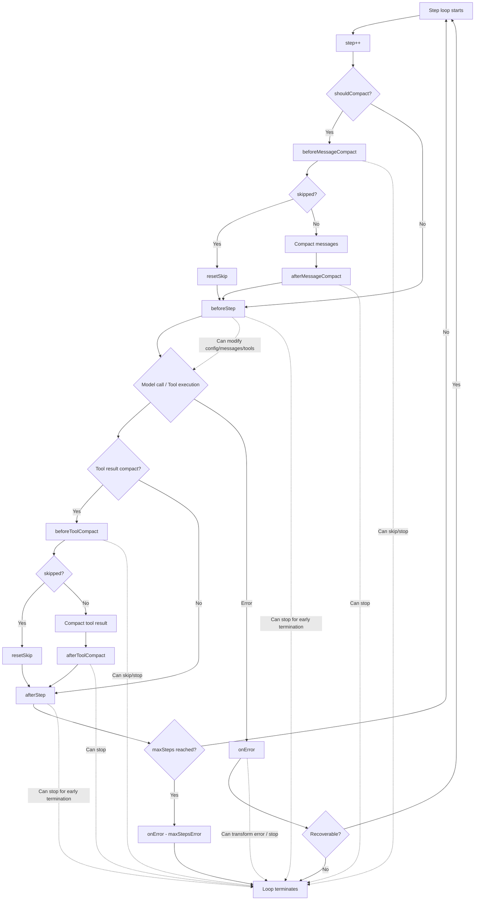

During execution, an agent goes through multiple steps — model reasoning, tool calls, structured output. Hooks let you insert custom logic at key points in this flow, enabling logging, dynamic configuration, flow control, and error handling without modifying core code. Whether tracking each step's execution state or switching models based on runtime conditions, Hooks provide a clean and powerful extension mechanism.

## Three Hooks

deepseek-kit provides three lifecycle hooks covering the complete agent execution flow:

| Hook | Trigger | Typical Use |
|------|---------|------------|
| `beforeStep` | Before each step starts | Logging, dynamic config modification, early termination |
| `afterStep` | After each step completes | Logging, result tracking, early termination |
| `onError` | When a step execution error occurs | Error handling, custom error transformation |

Additionally, four **Compact Hooks** are available for controlling the context compaction process:

| Hook | Trigger | Typical Use |
|------|---------|------------|
| `beforeMessageCompact` | Before conversation history is compacted | Skip compaction, early termination, logging |
| `afterMessageCompact` | After conversation history is compacted | Quality inspection, metrics tracking |
| `beforeToolCompact` | Before a tool result is compacted | Skip compaction, early termination, logging |
| `afterToolCompact` | After a tool result is compacted | Quality inspection, metrics tracking |

```ts
import { createAgent, createModel } from 'deepseek-kit'

const model = createModel({ model: 'deepseek-v4-flash' })

const agent = createAgent({
  model,
  hooks: {
    beforeStep: (context, hookCtx) => {
      console.log(`Step ${context.step} starting`)
    },
    afterStep: (step, hookCtx) => {
      console.log(`Step ${step.step} completed: ${step.type}`)
    },
    onError: (error, hookCtx) => {
      console.error(`Step error: ${error.type} - ${error.message}`)
    },
  },
})
```

## beforeStep — Pre-Step Interception

`beforeStep` is called before each step starts, receiving the current step's context information and HookContext. You can use it to:

- Log execution progress
- Dynamically modify the current step's configuration
- Replace the current step's messages or tools
- Terminate the loop early

### Parameters

`beforeStep` receives two parameters:

1. **`context`** — Current step's context information
2. **`hookCtx`** — Hook context, providing the `stop()` method

### Logging

The simplest usage is logging the start of each step:

```ts
beforeStep: (context, hookCtx) => {
  console.log(`Step ${context.step} starting, ${context.messages.length} messages currently`)
}
```

### Dynamic Configuration Modification

`beforeStep` can return an object to modify the current step's configuration. The returned object is merged with the default configuration:

```ts
beforeStep: (context, hookCtx) => {
  if (context.step > 5) {
    return {
      config: {
        model: 'deepseek-v4-pro',
      },
    }
  }
}
```

This switches the agent to the Pro model after step 6. Modifiable configuration items include:

- **`config`** — Model configuration (model, temperature, maxTokens, etc.)
- **`messages`** — Message list for the current step
- **`tools`** — Available tools for the current step

### Dynamic Tool Selection

Dynamically adjust available tools based on step number or context:

```ts
beforeStep: (context, hookCtx) => {
  if (context.step === 1) {
    return {
      tools: [searchTool],
    }
  }
  return {
    tools: [searchTool, calculatorTool, weatherTool],
  }
}
```

### Modifying Messages

Inject additional messages before a specific step:

```ts
beforeStep: (context, hookCtx) => {
  if (context.step === 3) {
    return {
      messages: [
        ...context.messages,
        { role: 'system', content: 'Please cite data sources in your response.' },
      ],
    }
  }
}
```

### Early Termination

You can terminate the agent's execution loop early via `hookCtx.stop()` in any hook:

```ts
beforeStep: (context, hookCtx) => {
  if (context.step > 10) {
    hookCtx.stop()
  }
}
```

After calling `stop()`, the agent immediately ends the loop and returns the current results. This is useful when you need custom termination conditions.

## afterStep — Post-Step Processing

`afterStep` is called after each step completes, receiving the step result and HookContext. The step type determines what information is available in the result:

### Step Types

| Type | Description | Available Fields |
|------|-------------|-----------------|
| `'tool'` | Tool call step | `toolCalls`, `text`, `usage` |
| `'text'` | Text generation step | `text`, `usage` |
| `'format'` | Structured output step | `text`, `usage` |

### Logging

Log the execution result of each step:

```ts
afterStep: (step, hookCtx) => {
  console.log(`Step ${step.step} completed: ${step.type}`)

  if (step.type === 'tool' && step.toolCalls) {
    console.log(`  Tool calls: ${step.toolCalls.map(t => t.function.name).join(', ')}`)
  }

  if (step.type === 'text') {
    console.log(`  Generated text: ${step.text?.substring(0, 50)}...`)
  }

  console.log(`  Token usage: ${step.usage.total_tokens}`)
}
```

### Token Usage Tracking

Track cumulative token consumption via `afterStep`:

```ts
let totalTokens = 0

afterStep: (step, hookCtx) => {
  totalTokens += step.usage.total_tokens
  console.log(`Cumulative tokens: ${totalTokens}`)
}
```

### Tool Call Monitoring

Specifically monitor tool call steps:

```ts
afterStep: (step, hookCtx) => {
  if (step.type === 'tool' && step.toolCalls) {
    for (const tc of step.toolCalls) {
      console.log(`[Tool Call] ${tc.function.name}`)
      console.log(`  Arguments: ${tc.function.arguments}`)
    }
  }
}
```

### Early Termination

`afterStep` also supports early termination via `hookCtx.stop()`:

```ts
afterStep: (step, hookCtx) => {
  if (step.type === 'tool' && step.toolCalls) {
    const names = step.toolCalls.map(t => t.function.name)
    if (names.includes('dangerousAction')) {
      hookCtx.stop()
    }
  }
}
```

## onError — Error Handling

`onError` is called when a step execution error occurs, receiving an `AgentError` and HookContext. You can use it to:

- Log error information
- Customize error transformation
- Decide whether to continue execution based on error type

### Error Types

`AgentError` contains a `type` field identifying the error category:

| Type | Description | Retryable |
|------|-------------|-----------|
| `'rate_limit'` | API rate limit | ✅ |
| `'model_error'` | Model returned error | ✅ |
| `'timeout'` | Request timeout | ✅ |
| `'network_error'` | Network connection error | ✅ |
| `'tool_error'` | Tool execution error | ❌ |
| `'max_steps'` | Maximum steps reached | ❌ |
| `'schema_error'` | Structured output validation failure | ❌ |

### Logging

Log error information for debugging:

```ts
onError: (error, hookCtx) => {
  console.error(`[Error] Step ${error.step}: ${error.type} - ${error.message}`)
  if (error.retryable) {
    console.log('  This error is retryable')
  }
}
```

### Custom Error Transformation

`onError` can return a new `AgentError` to replace the original error, or return `undefined` to suppress the error (allowing the loop to continue):

```ts
onError: (error, hookCtx) => {
  if (error.type === 'rate_limit') {
    console.log('Rate limit encountered, will auto-retry...')
    return undefined
  }

  if (error.type === 'network_error') {
    return new AgentError({
      message: 'Network connection failed. Please check your network settings and retry.',
      type: 'network_error',
      step: error.step,
      retryable: false,
    })
  }

  return error
}
```

Return value rules:

- **Return `undefined`** — Suppress the error, the loop continues to the next step
- **Return `AgentError`** — Replace the original error with the new one; if `hookCtx.stop()` is called, the loop terminates
- **Return nothing (void)** — The original error continues to be thrown

### Early Termination

Combining `hookCtx.stop()` in `onError` enables graceful termination when specific errors occur:

```ts
onError: (error, hookCtx) => {
  if (error.type === 'max_steps') {
    console.log('Maximum step limit reached, terminating early.')
    hookCtx.stop()
    return
  }

  if (!error.retryable) {
    console.error(`Non-retryable error: ${error.message}`)
    hookCtx.stop()
  }
}
```

## Compact Hooks

When the agent's context window approaches its limit, deepseek-kit automatically compacts conversation history and tool results to free up space. Compact Hooks let you observe and control this compaction process.

### beforeMessageCompact — Pre-Compaction Interception

`beforeMessageCompact` is called before conversation history is compacted. You can use it to:

- Log compaction events (token count, threshold, etc.)
- Skip compaction for the current step via `hookCtx.skip()`
- Terminate the agent loop via `hookCtx.stop()`

```ts
const agent = createAgent({
  model,
  compact: true,
  hooks: {
    beforeMessageCompact: (context, hookCtx) => {
      console.log(`Compaction triggered: ${context.promptTokens} tokens, threshold ${context.threshold}`)
    },
  },
})
```

#### Skip Compaction

In some scenarios (e.g., code generation tasks), you may not want to lose conversation details. Use `hookCtx.skip()` to skip compaction for the current step:

```ts
beforeMessageCompact: (context, hookCtx) => {
  if (context.promptTokens < 900_000) {
    console.log('Context not yet critical, skipping compaction.')
    hookCtx.skip()
  }
}
```

After `skip()`, the agent continues normally without compacting. The `skip` state is automatically reset after each compaction decision.

#### Terminate on Compaction

If you want to stop the agent entirely when compaction would occur:

```ts
beforeMessageCompact: (context, hookCtx) => {
  console.log('Context limit reached, terminating to preserve full history.')
  hookCtx.stop()
}
```

### afterMessageCompact — Post-Compaction Processing

`afterMessageCompact` is called after conversation history has been compacted. You can use it to:

- Inspect the compaction result (messages before/after)
- Track token savings
- Validate summary quality

```ts
afterMessageCompact: (event, hookCtx) => {
  const beforeCount = event.messagesBefore.length
  const afterCount = event.messagesAfter.length
  console.log(`Compacted: ${beforeCount} messages → ${afterCount} messages`)
}
```

### beforeToolCompact — Pre-Tool-Result-Compaction Interception

`beforeToolCompact` is called before a tool result is compacted. Similar to `beforeMessageCompact`, it supports `skip()` and `stop()`:

```ts
beforeToolCompact: (context, hookCtx) => {
  if (context.toolName === 'codeSearch') {
    console.log('Skipping compaction for code search results.')
    hookCtx.skip()
  }
}
```

### afterToolCompact — Post-Tool-Result-Compaction Processing

`afterToolCompact` is called after a tool result has been compacted:

```ts
afterToolCompact: (event, hookCtx) => {
  const ratio = event.contentAfter.length / event.contentBefore.length
  console.log(`Tool "${event.toolName}" compacted: ${event.contentBefore.length} → ${event.contentAfter.length} chars (${(ratio * 100).toFixed(1)}%)`)
}
```

### HookContext: stop() and skip()

`HookContext` provides two control methods:

| Method | Effect | Scope |
|--------|--------|-------|
| `stop()` | Terminate the entire agent loop | Permanent — the loop ends immediately |
| `skip()` | Skip the current compaction operation | One-time — automatically resets after each decision |

```ts
hooks: {
  beforeMessageCompact: (context, hookCtx) => {
    if (context.promptTokens < 900_000) {
      hookCtx.skip()
    }
    else if (context.promptTokens > 950_000) {
      hookCtx.stop()
    }
  },
}
```

::callout{icon="lucide:info"}
`skip()` can be called from any hook, but it only takes effect in compact hooks (`beforeMessageCompact` and `beforeToolCompact`). Calling `skip()` in `beforeStep` or `afterStep` has no effect.
::

## Combining Hooks

The three hooks are typically used together to build complete observability and control logic:

### Complete Logging Middleware

```ts
const agent = createAgent({
  model,
  tools: [weatherTool, searchTool],
  hooks: {
    beforeStep: (context, hookCtx) => {
      console.log(`\n--- Step ${context.step} ---`)
      console.log(`Messages: ${context.messages.length}`)
      console.log(`Available tools: ${context.tools.map(t => t.name).join(', ')}`)
    },
    afterStep: (step, hookCtx) => {
      if (step.type === 'tool') {
        console.log(`Tool calls: ${step.toolCalls?.map(t => t.function.name).join(', ')}`)
      }
      else if (step.type === 'text') {
        console.log(`Generated text (${step.text?.length} characters)`)
      }
      console.log(`Tokens: ${step.usage.total_tokens}`)
    },
    onError: (error, hookCtx) => {
      console.error(`Error: [${error.type}] ${error.message}`)
      if (!error.retryable) {
        hookCtx.stop()
      }
    },
  },
})
```

### Dynamic Model Switching

Dynamically switch models based on step progress — using a fast model early on, then switching to a high-precision model later:

```ts
const fastModel = createModel({ model: 'deepseek-v4-flash' })
const proModel = createModel({ model: 'deepseek-v4-pro' })

const agent = createAgent({
  model: fastModel,
  tools: [searchTool, analysisTool],
  hooks: {
    beforeStep: (context, hookCtx) => {
      if (context.step >= 3) {
        return {
          config: {
            model: 'deepseek-v4-pro',
          },
        }
      }
    },
    afterStep: (step, hookCtx) => {
      console.log(`Step ${step.step} (${step.type}), Tokens: ${step.usage.total_tokens}`)
    },
  },
})
```

### Step Limits and Graceful Degradation

Gracefully terminate when there are too many steps, rather than throwing an error directly:

```ts
const agent = createAgent({
  model,
  tools: [searchTool],
  maxSteps: 20,
  hooks: {
    beforeStep: (context, hookCtx) => {
      if (context.step > 10) {
        console.log(`Step ${context.step} exceeds recommended limit, preparing to terminate.`)
        hookCtx.stop()
      }
    },
    onError: (error, hookCtx) => {
      if (error.type === 'max_steps') {
        console.log('Maximum steps reached, returning existing results.')
        hookCtx.stop()
      }
    },
  },
})
```

### Token Budget Control

Set a token budget and terminate early when it's exceeded:

```ts
let totalTokens = 0
const TOKEN_BUDGET = 10000

const agent = createAgent({
  model,
  tools: [searchTool],
  hooks: {
    afterStep: (step, hookCtx) => {
      totalTokens += step.usage.total_tokens
      if (totalTokens > TOKEN_BUDGET) {
        console.log(`Token budget exhausted (${totalTokens}/${TOKEN_BUDGET}), terminating early.`)
        hookCtx.stop()
      }
    },
  },
})
```

## Execution Flow

The following shows when hooks are triggered in the agent loop:



::callout{icon="lucide:info"}
`beforeStep` and `afterStep` are also triggered during structured output steps, where the step type is `'format'`. During structured output retries, hooks are triggered for each retry attempt.
::

## API Reference

### GenerateTextHooks

::field-group
  ::field{name="beforeStep" type="(context: BeforeStepContext, hookCtx: HookContext) => BeforeStepResult | void"}
  Pre-step hook. Receives the current step context and hook context, can return a configuration modification object.
  ::

  ::field{name="afterStep" type="(step: StepEvent, hookCtx: HookContext) => void"}
  Post-step hook. Receives the step result and hook context.
  ::

  ::field{name="onError" type="(error: AgentError, hookCtx: HookContext) => void | AgentError | Promise<AgentError | void>"}
  Error handling hook. Receives the error object and hook context. Can return `undefined` to suppress the error, or return a new `AgentError` to replace the original.
  ::

  ::field{name="beforeMessageCompact" type="(context: BeforeMessageCompactContext, hookCtx: HookContext) => void"}
  Pre-message-compaction hook. Receives the compaction context and hook context. Supports `hookCtx.skip()` to skip compaction and `hookCtx.stop()` to terminate the loop.
  ::

  ::field{name="afterMessageCompact" type="(event: MessageCompactEvent, hookCtx: HookContext) => void"}
  Post-message-compaction hook. Receives the compaction event (messages before/after, token count, threshold) and hook context.
  ::

  ::field{name="beforeToolCompact" type="(context: BeforeToolCompactContext, hookCtx: HookContext) => void"}
  Pre-tool-compaction hook. Receives the compaction context and hook context. Supports `hookCtx.skip()` to skip compaction and `hookCtx.stop()` to terminate the loop.
  ::

  ::field{name="afterToolCompact" type="(event: ToolCompactEvent, hookCtx: HookContext) => void"}
  Post-tool-compaction hook. Receives the compaction event (content before/after, tool name, threshold) and hook context.
  ::
::

### BeforeStepContext

::field-group
  ::field{name="step" type="number"}
  Current step number (starting from 1).
  ::

  ::field{name="config" type="ModelOptions"}
  Current model configuration, including model, temperature, maxTokens, etc.
  ::

  ::field{name="messages" type="ChatMessage[]"}
  Copy of the message list for the current step. Modifying `messages` in the return value replaces the current step's messages.
  ::

  ::field{name="tools" type="Tool[]"}
  List of tools available for the current step. Modifying `tools` in the return value replaces the current step's tools.
  ::
::

### BeforeStepResult

::field-group
  ::field{name="messages" type="ChatMessage[]"}
  Replace the message list for the current step.
  ::

  ::field{name="tools" type="Tool[]"}
  Replace the tool list for the current step.
  ::

  ::field{name="config" type="Partial<ModelOptions>"}
  Modify the model configuration for the current step. Supported fields include `model`, `temperature`, `maxTokens`, `thinking`, etc.
  ::
::

### StepEvent

::field-group
  ::field{name="step" type="number"}
  Step number.
  ::

  ::field{name="type" type="'tool' | 'text' | 'format'"}
  Step type. `'tool'` for tool call steps, `'text'` for text generation steps, `'format'` for structured output steps.
  ::

  ::field{name="usage" type="Usage"}
  Token usage for the current step.
  ::

  ::field{name="toolCalls" type="ChatCompletionTool[]"}
  Tool call list (only available for `'tool'` type steps).
  ::

  ::field{name="text" type="string"}
  Generated text content.
  ::

  ::field{name="reasoningContent" type="string"}
  Reasoning content (available when thinking mode is enabled).
  ::
::

### HookContext

::field-group
  ::field{name="stop" type="() => void"}
  Terminate the agent's execution loop. After calling, the agent immediately ends and returns the current results.
  ::

  ::field{name="skip" type="() => void"}
  Skip the current compaction operation. Only effective in `beforeMessageCompact` and `beforeToolCompact` hooks. The skip state is automatically reset after each compaction decision, so it only affects the current compaction.
  ::
::

### BeforeMessageCompactContext

::field-group
  ::field{name="promptTokens" type="number"}
  Current prompt token count when compaction is triggered.
  ::

  ::field{name="messages" type="ChatMessage[]"}
  Copy of the message list before compaction.
  ::

  ::field{name="threshold" type="number"}
  Compaction threshold (e.g., `0.85` means compaction triggers at 85% of context window).
  ::
::

### MessageCompactEvent

::field-group
  ::field{name="messagesBefore" type="ChatMessage[]"}
  Message list before compaction.
  ::

  ::field{name="messagesAfter" type="ChatMessage[]"}
  Message list after compaction.
  ::

  ::field{name="promptTokens" type="number"}
  Prompt token count when compaction was triggered.
  ::

  ::field{name="threshold" type="number"}
  Compaction threshold value.
  ::
::

### BeforeToolCompactContext

::field-group
  ::field{name="toolName" type="string"}
  Name of the tool whose result is about to be compacted.
  ::

  ::field{name="toolDescription" type="string"}
  Description of the tool.
  ::

  ::field{name="content" type="string"}
  Original tool result content.
  ::

  ::field{name="threshold" type="number"}
  Character length threshold for tool result compaction.
  ::
::

### ToolCompactEvent

::field-group
  ::field{name="toolName" type="string"}
  Name of the tool whose result was compacted.
  ::

  ::field{name="toolDescription" type="string"}
  Description of the tool.
  ::

  ::field{name="contentBefore" type="string"}
  Tool result content before compaction.
  ::

  ::field{name="contentAfter" type="string"}
  Tool result content after compaction.
  ::

  ::field{name="threshold" type="number"}
  Character length threshold for tool result compaction.
  ::
::

### AgentError

::field-group
  ::field{name="type" type="AgentErrorType"}
  Error type. Possible values are `'rate_limit'`, `'model_error'`, `'timeout'`, `'network_error'`, `'tool_error'`, `'max_steps'`, `'schema_error'`.
  ::

  ::field{name="message" type="string"}
  Error description.
  ::

  ::field{name="step" type="number"}
  Step number when the error occurred.
  ::

  ::field{name="retryable" type="boolean"}
  Whether the error is retryable. `'rate_limit'`, `'model_error'`, `'timeout'`, and `'network_error'` errors are retryable by default.
  ::

  ::field{name="cause" type="Error"}
  Original error object.
  ::
::
