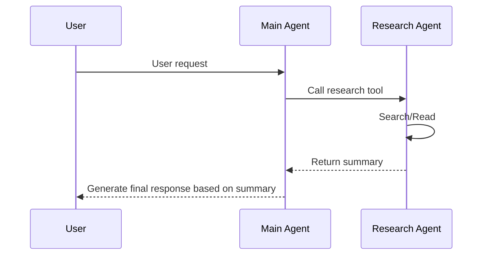

When a single agent's task is too complex, or you need to isolate different capabilities to specialized agents, subagents come into play. The core idea of subagents is simple: **encapsulate one agent as a tool for another agent to call**. The main agent handles orchestration and decision-making, while the subagent executes autonomously in an isolated context window, ultimately returning only a refined result. This pattern can handle tasks that require extensive context exploration while keeping the main agent's context clean and focused.

## When to Use Subagents

Subagents add latency and complexity — weigh the trade-offs based on your actual needs:

| Good Use Case | Not Recommended |
|--------------|----------------|
| Tasks requiring exploration of large context | Tasks are simple and focused |
| Need parallel processing of independent research | Sequential processing suffices |
| Context may exceed model limits | Context is always manageable |
| Need to isolate tool access by capability | All tools can safely coexist |

## Basic Usage

The subagent implementation pattern is straightforward: define an agent, then wrap it as a tool for the main agent to call:

```ts
import { createAgent, createModel, tool } from 'deepseek-kit'
import { z } from 'zod'

const model = createModel({ model: 'deepseek-v4-flash' })

const researchAgent = createAgent({
  model,
  system: 'You are a research assistant. Investigate the task thoroughly and clearly summarize your findings in your final response.',
  tools: [searchTool, readFileTool],
})

const researchTool = tool({
  name: 'research',
  description: 'Research a topic or question in depth',
  schema: z.object({
    task: z.string().describe('The task to research'),
  }),
  execute: async (input) => {
    const result = await researchAgent.generate({
      prompt: input.task,
    })
    return result.text
  },
})

const mainAgent = createAgent({
  model,
  system: 'You are an assistant that can delegate research tasks to a specialized research agent.',
  tools: [researchTool],
})

const result = await mainAgent.generate({
  messages: [{ role: 'user', content: 'Help me research the impact of quantum computing on cryptography.' }],
})

console.log(result.text)
```

Execution flow:

1. The main agent receives the user request and determines that in-depth research is needed
2. The main agent calls the `research` tool, passing the research task
3. The research agent executes autonomously in an isolated context (possibly calling search and reading tools multiple times)
4. The research agent returns a summarized result
5. The main agent generates the final response based on the research result



## Context Isolation

The core advantage of subagents is **context isolation**. Each time a subagent is called, it starts a fresh context window — it does not inherit the main agent's conversation history. This means:

- Subagents can use hundreds of thousands of tokens for exploration without polluting the main agent's context
- The main agent only receives the refined result returned by the subagent
- Multiple subagent calls don't cause context bloat

```ts
const researchTool = tool({
  name: 'research',
  description: 'Research a topic in depth',
  schema: z.object({ task: z.string() }),
  execute: async (input) => {
    const result = await researchAgent.generate({
      messages: [{ role: 'user', content: input.task }],
    })
    return result.text
  },
})
```

A subagent might consume 100,000 tokens for exploration and reasoning, but the main agent only consumes the returned summary text — perhaps just 1,000 tokens.

## Passing Conversation History

By default, subagents don't inherit the main agent's conversation history. If you need the subagent to be aware of previous conversation context, you can manually pass `messages`:

```ts
const researchTool = tool({
  name: 'research',
  description: 'Research a topic with conversation context',
  schema: z.object({ task: z.string() }),
  execute: async (input) => {
    const result = await researchAgent.generate({
      messages: [
        ...currentMessages,
        { role: 'user', content: input.task },
      ],
    })
    return result.text
  },
})
```

::callout{icon="lucide:info"}
Passing the full conversation history diminishes the benefits of context isolation. Use this judiciously — only pass history when the subagent genuinely needs to understand the conversation background.
::

## Parallel Subagents

When multiple research tasks are independent of each other, you can launch multiple subagents in parallel within a single tool, significantly reducing total latency:

```ts
import { createAgent, createModel, tool } from 'deepseek-kit'
import { z } from 'zod'

const model = createModel({ model: 'deepseek-v4-flash' })

const researchAgent = createAgent({
  model,
  system: 'You are a research assistant. Investigate the task thoroughly and clearly summarize your findings in your final response.',
  tools: [searchTool],
})

const compareTool = tool({
  name: 'compareTopics',
  description: 'Research multiple topics in parallel and return a comparison',
  schema: z.object({
    topics: z.array(z.string()).describe('List of topics to compare'),
  }),
  execute: async (input) => {
    const results = await Promise.all(
      input.topics.map(topic =>
        researchAgent.generate({ prompt: `Please research the following topic in depth and summarize: ${topic}` }),
      ),
    )
    return results.map((r, i) => `## ${input.topics[i]}\n${r.text}`).join('\n\n')
  },
})

const mainAgent = createAgent({
  model,
  system: 'You are an assistant that can research multiple topics in parallel and perform comparative analysis.',
  tools: [compareTool],
})

const result = await mainAgent.generate({
  messages: [{ role: 'user', content: 'Compare Python, JavaScript, and Rust for web development.' }],
})
```

In parallel mode, three subagents execute simultaneously — the total latency depends on the slowest one, not the sum of all three.

## Specialized Subagents

Create dedicated subagents for different types of tasks, each with its own model, system prompt, and tool set:

```ts
import { createAgent, createModel, tool } from 'deepseek-kit'
import { z } from 'zod'

const fastModel = createModel({ model: 'deepseek-v4-flash' })
const proModel = createModel({ model: 'deepseek-v4-pro' })

const codeAgent = createAgent({
  model: proModel,
  system: 'You are a code expert. Only responsible for writing and modifying code. Always output complete code blocks.',
  tools: [readFileTool, writeFileTool],
})

const reviewAgent = createAgent({
  model: proModel,
  system: 'You are a code review expert. Review code quality, security, and performance issues. Provide specific improvement suggestions.',
  tools: [readFileTool],
})

const codeTool = tool({
  name: 'writeCode',
  description: 'Write or modify code',
  schema: z.object({ task: z.string().describe('Code task description') }),
  execute: async (input) => {
    const result = await codeAgent.generate({ prompt: input.task })
    return result.text
  },
})

const reviewTool = tool({
  name: 'reviewCode',
  description: 'Review code quality',
  schema: z.object({ code: z.string().describe('Code to review') }),
  execute: async (input) => {
    const result = await reviewAgent.generate({ prompt: `Review the following code:\n${input.code}` })
    return result.text
  },
})

const mainAgent = createAgent({
  model: fastModel,
  system: 'You are a development assistant that can write and review code. First write the code, then review it, and finally provide an improved version.',
  tools: [codeTool, reviewTool],
})
```

Advantages of this pattern:

- **Tool Isolation** — The code agent has file write permissions, while the review agent only has read access
- **Model Selection** — Different tasks use models with different capabilities
- **Prompt Focus** — Each subagent's system prompt is optimized for its specific responsibility

## Subagents in Streaming

The subagent's execution process is part of the main agent's tool call. In streaming output, you can observe subagents being triggered in `tool-call` events:

```ts
const stream = mainAgent.stream({
  prompt: 'Help me research the application prospects of quantum computing.',
})

for await (const event of stream) {
  switch (event.type) {
    case 'text-delta':
      process.stdout.write(event.textDelta)
      break
    case 'tool-call':
      console.log(`\nCalling subagent: ${event.toolCalls.map(t => t.function.name).join(', ')}`)
      break
    case 'finish':
      console.log('\nDone!')
      break
  }
}
```

Note: The subagent's internal execution process (including its tool calls and text generation) is not pushed as stream events to the main agent. The main agent only receives the final result after the subagent completes.

## Aborting Subagents

You can abort an executing subagent via `AbortSignal`. When the main agent's request is canceled, the signal propagates to the subagent:

```ts
const researchTool = tool({
  name: 'research',
  description: 'Research a topic in depth',
  schema: z.object({ task: z.string() }),
  execute: async (input) => {
    const controller = new AbortController()

    const timeoutId = setTimeout(() => controller.abort(), 30000)

    try {
      const result = await researchAgent.generate({
        prompt: input.task,
        signal: controller.signal,
      })
      return result.text
    }
    finally {
      clearTimeout(timeoutId)
    }
  },
})
```

## Subagents with Structured Output

Subagents also support structured output. You can have a subagent return structured data conforming to a specific schema instead of free-form text:

```ts
const sentimentAgent = createAgent({
  model,
  system: 'You are a sentiment analysis expert.',
  output: {
    schema: z.object({
      sentiment: z.enum(['positive', 'negative', 'neutral']),
      confidence: z.number().min(0).max(1),
      keywords: z.array(z.string()),
    }),
  },
})

const sentimentTool = tool({
  name: 'analyzeSentiment',
  description: 'Analyze the sentiment of text',
  schema: z.object({ text: z.string().describe('Text to analyze') }),
  execute: async (input) => {
    const result = await sentimentAgent.generate({
      prompt: `Analyze the sentiment of the following text: ${input.text}`,
    })
    return result.output
  },
})
```

## Writing Subagent Prompts

A subagent's system prompt should explicitly instruct it to output a clear summary upon completion. Because the main agent can only see the subagent's return value, if the subagent only returns "Done," the main agent won't have useful information:

```ts
const researchAgent = createAgent({
  model,
  system: `You are a research assistant. Complete the task autonomously.

Important: After completing your research, clearly summarize your findings as your final response.
This summary will be returned to the main agent, so please include all relevant information.`,
  tools: [searchTool, readFileTool],
})
```

## Considerations

- **Context Isolation** — Each subagent call starts with a fresh context and doesn't inherit the main agent's conversation history. If you need to pass context, manually provide it via the `messages` parameter
- **Latency Stacking** — Subagent execution time stacks onto the main agent's total latency. For simple tasks, handling them directly in the main agent is more efficient
- **Error Propagation** — Uncaught errors in subagents are returned to the main agent as tool execution failures and don't directly interrupt the main agent's loop
- **Streaming Limitations** — Subagent internal stream events don't propagate to the main agent's stream. The main agent can only get results after the subagent completes

## API Reference

### Subagent Tool Pattern

::field-group
  ::field{name="execute" type="(input) => Promise<string>"}
  Call the subagent's `generate()` method in the tool's `execute` function, returning `result.text` as the tool result.
  ::

  ::field{name="signal" type="AbortSignal"}
  Pass the abort signal to the subagent via the `signal` parameter, ensuring the subagent terminates correctly when the request is canceled.
  ::

  ::field{name="messages" type="ChatMessage[]"}
  If the subagent needs to be aware of conversation context, manually pass the conversation history via the `messages` parameter.
  ::
::
