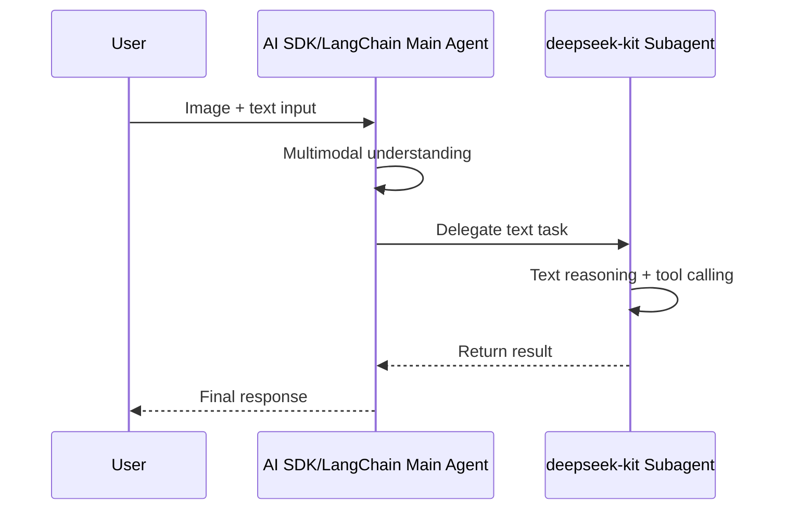
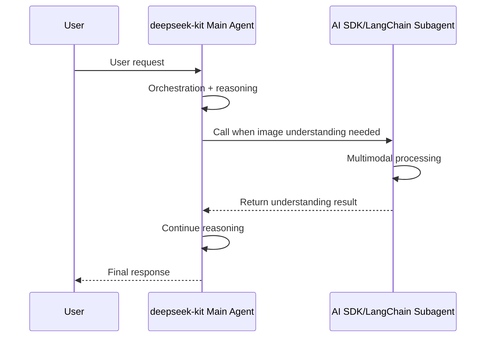

DeepSeek V4 currently doesn't support multimodal input (images, audio, files, etc.), while many real-world applications need to handle image understanding, voice interaction, and similar scenarios. By integrating deepseek-kit with frameworks like AI SDK and LangChain that support multimodality, you can **let each framework do what it does best** — deepseek-kit handles efficient text reasoning and tool calling, while other frameworks handle multimodal perception and proprietary model calls.

## Why Integration?

| Scenario | Description |
|----------|-------------|
| **Multimodal Input** | Users send images, PDFs, and other multimodal content that requires a multimodal model to understand before passing to DeepSeek |
| **Complementary Capabilities** | Certain tasks require specific model capabilities (e.g., OpenAI's DALL·E for image generation, Anthropic's long-text analysis) |
| **Progressive Migration** | Existing AI SDK or LangChain projects wanting to gradually adopt DeepSeek's cost advantages |
| **Cost Optimization** | Simple tasks use DeepSeek Flash, complex multimodal tasks use other models — allocate on demand |

## Two Integration Patterns

### Pattern 1: deepseek-kit as a Subagent

Wrap deepseek-kit's agent as a tool, embedding it in an AI SDK or LangChain main agent. The main agent handles multimodal understanding and task distribution, while the DeepSeek agent handles text reasoning and tool calling:



Use cases:
- User input contains images, files, or other multimodal content
- Main workflow needs multimodal understanding, subtasks only need text processing
- Want to introduce DeepSeek into an existing AI SDK/LangChain project

### Pattern 2: Other Frameworks as Subagents

Wrap AI SDK or LangChain agents as tools, embedding them in a deepseek-kit main agent. The DeepSeek agent serves as the orchestrator, calling other frameworks when multimodal capabilities are needed:



Use cases:
- Most tasks are text reasoning, with occasional need for multimodal capabilities
- Want deepseek-kit as the primary framework, calling other models on demand
- Leverage DeepSeek's low-cost advantage for handling primary traffic

## Choosing a Pattern

| Consideration | deepseek-kit as Subagent | Other Frameworks as Subagents |
|--------------|------------------------|------------------------------|
| Primary framework | AI SDK / LangChain | deepseek-kit |
| Multimodal frequency | Frequent | Occasional |
| Cost control | Main framework bears multimodal costs | DeepSeek handles primary traffic at lower cost |
| Code organization | Multimodal logic in main framework | Multimodal logic encapsulated as tools |
| Migration cost | Suitable for existing projects | Suitable for new projects |

## Install Dependencies

Install the corresponding dependencies based on your chosen integration method:

```bash
# For AI SDK integration
pnpm add deepseek-kit ai @ai-sdk/openai

# For LangChain integration
pnpm add deepseek-kit langchain @langchain/openai
```

Next, choose the integration guide you need:

- [AI SDK Integration](./ai-sdk) — Working with Vercel AI SDK
- [LangChain Integration](./langchain) — Working with LangChain.js
