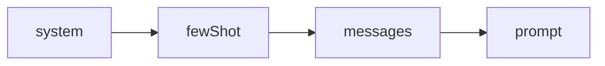
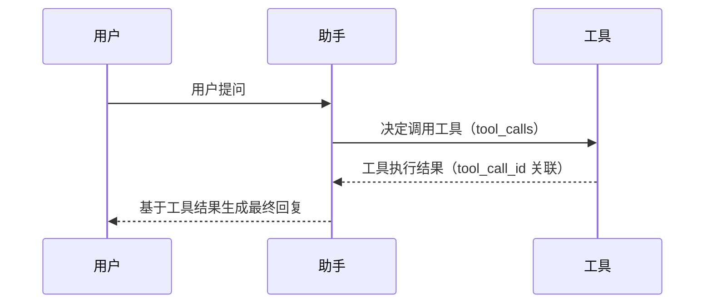

消息是 deepseek-kit 中模型交互的基本单元。每次调用模型时，你都在构建一组消息——用户的提问、助手的回复、系统的指令、工具的执行结果。理解消息的结构和使用方式，是构建任何 AI 应用的基础。deepseek-kit 采用与 DeepSeek API 兼容的消息格式，同时提供了 `prompt` 和 `system` 等简写方式，让你在不同场景下都能高效地组织输入。

## 提示词方式

deepseek-kit 支持三种方式向模型传递输入，适用于不同的场景：

### 文本提示词

最简单的方式——直接传入一个字符串作为用户输入：

```ts
import { createModel, generateText } from 'deepseek-kit'

const model = createModel({ model: 'deepseek-v4-flash' })

const result = await generateText({
  model,
  prompt: '用三段话介绍量子计算的基本原理。',
})
```

你也可以使用模板字符串注入动态数据：

```ts
const result = await generateText({
  model,
  prompt: `我计划去${destination}旅行${days}天，请推荐最佳的旅游活动。`,
})
```

### 系统提示词

通过 `system` 参数为模型设定角色和行为准则。系统提示词会作为第一条 `system` 消息发送给模型，引导它以特定方式回应：

```ts
const result = await generateText({
  model,
  system: '你是一个旅行规划助手。始终提供详细的行程建议，包含时间安排和费用估算。',
  prompt: '我计划去东京旅行5天，请推荐行程。',
})
```

系统提示词可以与 `prompt` 或 `messages` 组合使用：

```ts
const result = await generateText({
  model,
  system: '你是一个研究助手。始终引用来源并提供详细解释。',
  prompt: '量子纠缠的基本原理是什么？',
})
```

### 消息列表

当你需要维护多轮对话历史时，使用 `messages` 数组。每条消息包含 `role` 和 `content` 两个字段：

```ts
const result = await generateText({
  model,
  messages: [
    { role: 'user', content: '你好！' },
    { role: 'assistant', content: '你好！有什么我可以帮助你的吗？' },
    { role: 'user', content: '柏林最好的咖喱香肠在哪里？' },
  ],
})
```

::callout{icon="lucide:info"}
`prompt` 和 `messages` 是两种互斥的输入方式。`prompt` 适用于单次请求，`messages` 适用于多轮对话。`system` 和 `fewShot` 可以与两者组合使用。
::

## 消息组装顺序

当你同时使用 `system`、`fewShot`、`messages` 和 `prompt` 时，deepseek-kit 会按照固定的顺序将它们组装为最终的消息数组：



**system → fewShot → messages → prompt**

```ts
const result = await generateText({
  model,
  system: '你是一个翻译助手。',
  fewShot: [
    { role: 'user', content: 'Hello' },
    { role: 'assistant', content: '你好' },
  ],
  messages: [
    { role: 'user', content: 'Good morning' },
    { role: 'assistant', content: '早上好' },
  ],
  prompt: 'Thank you',
})
```

最终发送给模型的消息数组为：

```ts
[
  { role: 'system', content: '你是一个翻译助手。' },  // system
  { role: 'user', content: 'Hello' },                 // fewShot
  { role: 'assistant', content: '你好' },              // fewShot
  { role: 'user', content: 'Good morning' },          // messages
  { role: 'assistant', content: '早上好' },            // messages
  { role: 'user', content: 'Thank you' },             // prompt
]
```

每个参数承担不同的职责：

| 参数 | 职责 | 位置 |
|------|------|------|
| `system` | 设定模型的角色和行为准则 | 最前面，作为 `system` 消息 |
| `fewShot` | 提供示例对话，引导模型的回复风格和格式 | 在 `system` 之后、`messages` 之前 |
| `messages` | 承载多轮对话历史 | 在 `fewShot` 之后、`prompt` 之前 |
| `prompt` | 当前用户输入，以单个字符串表示 | 最后，作为 `user` 消息 |

::callout{icon="lucide:info"}
`system` 和 `fewShot` 是配置级输入——它们定义模型**应该如何**行为。`messages` 和 `prompt` 是对话级输入——它们定义模型**需要回应什么**。`prompt` 和 `messages` 互斥。
::

## 消息类型

deepseek-kit 定义了四种消息类型，对应对话中的不同角色：

### SystemMessage — 系统消息

设定模型的行为准则和角色定位，在对话开始前发送：

```ts
{ role: 'system', content: '你是一个专业的代码审查助手。' }
```

可选字段：

- `name` — 参与者名称，用于区分不同的系统指令来源

```ts
{ role: 'system', content: '请使用中文回复。', name: 'language_config' }
```

推荐使用 `system` 参数而非在 `messages` 中手动添加系统消息，这样更清晰也更安全。

### UserMessage — 用户消息

代表用户的输入，是最常用的消息类型：

```ts
{ role: 'user', content: '请帮我解释什么是闭包。' }
```

可选字段：

- `name` — 用户标识，用于多用户场景

```ts
{ role: 'user', content: '今天天气怎么样？', name: 'alice' }
```

### AssistantMessage — 助手消息

代表模型的回复。助手消息可以包含文本内容、工具调用和推理内容：

**纯文本回复：**

```ts
{ role: 'assistant', content: '闭包是指函数能够访问其词法作用域中的变量，即使函数在其词法作用域之外执行。' }
```

**带工具调用的回复：**

```ts
{
  role: 'assistant',
  content: null,
  tool_calls: [
    {
      id: 'call_abc123',
      type: 'function',
      function: {
        name: 'getWeather',
        arguments: '{"city":"北京"}',
      },
    },
  ],
}
```

**带推理内容的回复（思考模式）：**

```ts
{
  role: 'assistant',
  prefix: true,
  reasoning_content: '用户问的是天气，我需要调用天气工具来获取实时数据...',
  content: '让我帮你查询北京的天气。'
}
```

当模型启用思考模式时，`reasoning_content` 字段包含模型的推理过程，`content` 包含最终回复。

### ToolMessage — 工具消息

代表工具执行的结果，通过 `tool_call_id` 与对应的工具调用关联：

```ts
{
  role: 'tool',
  tool_call_id: 'call_abc123',
  content: '{"success":true,"data":{"city":"北京","temperature":22,"condition":"晴"}}'
}
```

`tool_call_id` 必须与 `AssistantMessage` 中 `tool_calls` 数组里对应项的 `id` 一致，模型才能正确匹配工具调用和结果。

## 多轮对话

使用 `messages` 数组构建多轮对话，每轮对话都包含用户消息和助手消息：

```ts
import { createAgent, createModel } from 'deepseek-kit'

const model = createModel({ model: 'deepseek-v4-flash' })

const agent = createAgent({ model })

const result = await agent.generate({
  messages: [
    { role: 'user', content: '什么是机器学习？' },
    { role: 'assistant', content: '机器学习是人工智能的一个分支，它让计算机能够从数据中学习规律，而无需显式编程。' },
    { role: 'user', content: '它和深度学习有什么区别？' },
  ],
})

console.log(result.text)
```

## 工具调用消息流

当智能体调用工具时，消息流遵循固定的模式：



```ts
const messages = [
  { role: 'user', content: '北京今天天气怎么样？' },
  {
    role: 'assistant',
    content: null,
    tool_calls: [{
      id: 'call_001',
      type: 'function',
      function: { name: 'getWeather', arguments: '{"city":"北京"}' },
    }],
  },
  {
    role: 'tool',
    tool_call_id: 'call_001',
    content: '{"success":true,"data":{"city":"北京","temperature":22,"condition":"晴"}}',
  },
  {
    role: 'assistant',
    content: '北京今天天气晴，温度22摄氏度，湿度60%。',
  },
]
```

::callout{icon="lucide:info"}
在智能体模式下，你不需要手动构建工具调用消息流。`createAgent` 会自动处理 AssistantMessage 和 ToolMessage 的生成和关联。
::

## 手动构建对话历史

在某些场景下，你可能需要手动构建对话历史——例如从数据库加载历史记录，或模拟特定的对话上下文：

```ts
import { createModel, generateText, tool } from 'deepseek-kit'
import { z } from 'zod'

const model = createModel({ model: 'deepseek-v4-flash' })

const weatherTool = tool({
  name: 'getWeather',
  description: '查询城市天气',
  schema: z.object({ city: z.string() }),
  execute: async input => `${input.city} 今日晴，22°C`,
})

const result = await generateText({
  model,
  tools: [weatherTool],
  messages: [
    { role: 'system', content: '你是一个天气助手。' },
    { role: 'user', content: '北京天气怎么样？' },
    {
      role: 'assistant',
      content: null,
      tool_calls: [{
        id: 'call_prev_001',
        type: 'function',
        function: { name: 'getWeather', arguments: '{"city":"北京"}' },
      }],
    },
    {
      role: 'tool',
      tool_call_id: 'call_prev_001',
      content: '{"success":true,"data":{"city":"北京","temperature":22,"condition":"晴"}}',
    },
    { role: 'assistant', content: '北京今天天气晴，温度22摄氏度。' },
    { role: 'user', content: '那上海呢？' },
  ],
})
```

## prompt 与 messages 的选择

| 特性 | `prompt` | `messages` |
|------|---------|-----------|
| 输入方式 | 单个字符串 | 消息数组 |
| 适用场景 | 单次请求、无状态生成 | 多轮对话、有状态交互 |
| 系统提示词 | 通过 `system` 参数 | 通过 `system` 参数或 `system` 消息 |
| Few-shot 示例 | 通过 `fewShot` 参数 | 通过 `fewShot` 参数或包含在 `messages` 中 |
| 工具调用历史 | 不支持 | 支持 |
| 对话连续性 | 无 | 完整保留 |

选择建议：

- **一次性生成** — 使用 `prompt`，如内容创作、数据提取
- **聊天应用** — 使用 `messages`，如客服对话、交互式问答
- **需要历史上下文** — 使用 `messages`，如跟进提问、多步推理

## API 参考

### ChatMessage 类型

::field-group
  ::field{name="SystemMessage" type="{ role: 'system', content: string, name?: string }"}
  系统消息。设定模型的行为准则和角色定位。
  ::

  ::field{name="UserMessage" type="{ role: 'user', content: string, name?: string }"}
  用户消息。代表用户的输入。
  ::

  ::field{name="AssistantMessage" type="{ role: 'assistant', content: string | null, tool_calls?: ChatCompletionTool[], reasoning_content?: string }"}
  助手消息。代表模型的回复，可包含文本、工具调用和推理内容。
  ::

  ::field{name="ToolMessage" type="{ role: 'tool', content: string, tool_call_id: string }"}
  工具消息。代表工具执行的结果，通过 `tool_call_id` 关联到对应的工具调用。
  ::
::

### ChatCompletionTool 类型

::field-group
  ::field{name="id" type="string"}
  工具调用的唯一标识符。用于将工具执行结果与调用请求关联。
  ::

  ::field{name="type" type="'function'"}
  工具调用类型，当前仅支持 `'function'`。
  ::

  ::field{name="function.name" type="string"}
  被调用的工具名称。
  ::

  ::field{name="function.arguments" type="string"}
  工具调用的参数，JSON 字符串格式。
  ::
::

### 输入参数

::field-group
  ::field{name="prompt" type="string"}
  文本提示词。作为单条用户消息发送给模型。与 `messages` 互斥。
  ::

  ::field{name="system" type="string"}
  系统提示词。作为第一条系统消息发送给模型。可与 `prompt` 或 `messages` 组合使用。
  ::

  ::field{name="fewShot" type="ChatMessage[]"}
  Few-shot 示例消息。插入在 `system` 消息之后、`messages` 之前。用于通过示范引导模型的回复风格和格式。可与 `prompt` 或 `messages` 组合使用。
  ::

  ::field{name="messages" type="ChatMessage[]"}
  消息数组。用于构建多轮对话或包含工具调用历史的上下文。与 `prompt` 互斥。
  ::
::
