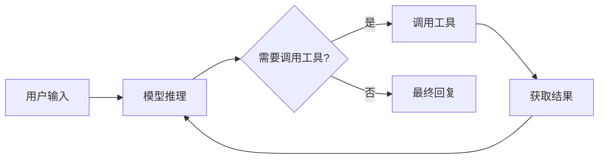

智能体是 deepseek-kit 中最强大的抽象。它将**模型**、**工具**和**多步循环**组合在一起——模型负责推理和决策，工具负责与外部世界交互，循环负责持续执行直到得出最终答案。这种模式被称为 ReAct（Reasoning + Acting），是构建 AI 应用的核心范式。

## 创建智能体

使用 `createAgent()` 创建智能体。你只需要提供一个模型实例，智能体就可以工作了：

```ts
import { createAgent, createModel } from 'deepseek-kit'

const model = createModel({ model: 'deepseek-v4-flash' })

const agent = createAgent({ model })

const result = await agent.generate({
  prompt: '你好！',
})

console.log(result.text)
```

但智能体的真正威力在于工具。为智能体配备工具后，它就能自主决定何时调用工具、如何处理结果，并持续推理直到完成任务：

```ts
import { createAgent, createModel, tool } from 'deepseek-kit'
import { z } from 'zod'

const model = createModel({ model: 'deepseek-v4-flash' })

const weatherTool = tool({
  name: 'getWeather',
  description: '查询城市的天气信息',
  schema: z.object({
    city: z.string().describe('城市名称'),
  }),
  execute: async (input) => {
    return `${input.city} 今日天气晴，温度22摄氏度，湿度60%。`
  },
})

const agent = createAgent({
  model,
  tools: [weatherTool],
})

const result = await agent.generate({
  prompt: '重庆今天天气怎么样？',
})

console.log(result.text)
```

## 智能体如何工作

智能体遵循 ReAct 循环运行：

1. **推理** — 模型分析用户输入和当前上下文，决定下一步行动
2. **行动** — 如果需要调用工具，模型生成工具调用；否则直接生成文本回复
3. **观察** — 工具执行结果被添加到对话中，作为下一步的输入
4. **循环** — 重复以上步骤，直到模型生成最终回复或达到最大步数



最大步数默认为 50，你可以通过 `maxSteps` 在创建智能体时进行控制：

```ts
const agent = createAgent({
  model,
  maxSteps: 10,
})

const result = await agent.generate({
  prompt: '复杂查询',
})
```

## 流式输出

使用 `stream()` 方法可以实时获取智能体的输出，包括文本增量和工具调用事件：

```ts
const stream = agent.stream({
  prompt: '重庆今天天气怎么样？',
})

for await (const event of stream) {
  switch (event.type) {
    case 'text-delta':
      process.stdout.write(event.textDelta)
      break
    case 'tool-call':
      console.log(`\n调用工具: ${event.toolCalls.map(t => t.function.name).join(', ')}`)
      break
    case 'finish':
      console.log('\n完成！')
      break
  }
}
```

## 系统提示词

通过 `system` 参数为智能体设定角色和行为准则，引导它以特定方式回应：

```ts
const agent = createAgent({
  model,
  tools: [searchTool],
  system: '你是一个研究助手。始终引用来源并提供详细的解释。',
})
```

## Few-Shot 少样本

通过 `fewShot` 参数提供示例对话，引导模型的回复风格和格式。Few-shot 示例会被插入在系统提示词之后、实际对话之前，帮助模型从示范中学习期望的模式：

```ts
const agent = createAgent({
  model,
  system: '你是一个翻译助手。',
  fewShot: [
    { role: 'user', content: 'Hello' },
    { role: 'assistant', content: '你好' },
    { role: 'user', content: 'Goodbye' },
    { role: 'assistant', content: '再见' },
  ],
})

const result = await agent.generate({
  prompt: 'Thank you',
})

console.log(result.text) // 谢谢
```

最终对话中的消息顺序为：**system → fewShot → messages → prompt**。

## 结构化输出

智能体可以返回符合 Zod Schema 的结构化数据，而不仅仅是自由文本。这在需要将智能体的输出集成到其他系统时非常有用：

```ts
const agent = createAgent({
  model,
  tools: [weatherTool],
  output: {
    schema: z.object({
      city: z.string(),
      weather: z.string(),
      temperature: z.number(),
      recommendation: z.string(),
    }),
  },
})

const result = await agent.generate({
  prompt: '北京天气怎么样？需要带伞吗？',
})

console.log(result.output)
// { city: '北京', weather: '晴', temperature: 22, recommendation: '不需要带伞。' }
```

## 生命周期 Hook

智能体支持三个生命周期 Hook，让你可以在每个步骤前后插入自定义逻辑——用于日志记录、动态修改消息、调整配置和处理错误：

```ts
const agent = createAgent({
  model,
  tools: [weatherTool],
  hooks: {
    beforeStep: (context, hookCtx) => {
      console.log(`步骤 ${context.step} 开始，${context.messages.length} 条消息`)
    },
    afterStep: (step, hookCtx) => {
      console.log(`步骤 ${step.step} 完成: ${step.type}`)
      if (step.toolCalls) {
        console.log(`  调用工具: ${step.toolCalls.map(t => t.function.name).join(', ')}`)
      }
    },
    onError: (error, hookCtx) => {
      console.error(`步骤出错: ${error.type} - ${error.message}`)
    },
  },
})
```

你还可以通过 `hookCtx.stop()` 提前终止循环：

```ts
beforeStep: (context, hookCtx) => {
  if (context.step > 5) {
    hookCtx.stop()
  }
}
```

也可以在 `beforeStep` 中通过返回配置来修改当前步骤的配置：

```ts
beforeStep: (context, hookCtx) => {
  if (context.step > 5) {
    return {
      config: {
        model: 'deepseek-v4-pro',
      },
    }
  }
}
```

这将导致智能体在第 6 步后切换到 Pro 模型。

## API 参考

### 参数

::field-group
  ::field{name="model" type="DeepSeekModel" required}
  模型实例，作为智能体的推理引擎。
  ::

  ::field{name="tools" type="Tool[]"}
  可用工具列表。智能体会根据用户输入自主决定调用哪些工具。
  ::

  ::field{name="system" type="string"}
  系统提示词，用于设定智能体的角色和行为准则。
  ::

  ::field{name="fewShot" type="ChatMessage[]"}
  Few-shot 示例消息，插入在系统提示词之后、对话之前。用于通过示范引导模型的回复风格和格式。
  ::

  ::field{name="output" type="{ schema: ZodSchema }"}
  结构化输出 Schema。指定后，智能体将返回符合 Schema 的结构化数据。
  ::

  ::field{name="hooks" type="GenerateTextHooks"}
  生命周期 Hook，包含 `beforeStep`、`afterStep` 和 `onError`。
  ::

  ::field{name="maxSteps" type="number" defaultValue="50"}
  最大执行步数。达到此限制后循环终止。
  ::

  ::field{name="signal" type="AbortSignal"}
  中止信号，用于取消正在执行的智能体请求。
  ::
::

### 方法

::field-group
  ::field{name="generate(params)" type="Promise<GenerateTextResult>"}
  执行智能体并返回完整结果。`params` 包含 `prompt` 或 `messages`。
  ::

  ::field{name="stream(params)" type="AsyncGenerator<StreamEvent>"}
  流式执行智能体，按事件返回。事件类型包括 `text-delta`、`reasoning-delta`、`tool-call`、`step` 和 `finish`。
  ::
::

### StreamEvent 类型

::field-group
  ::field{name="text-delta" type="TextDeltaStreamEvent"}
  文本增量事件，包含 `textDelta` 字段。
  ::

  ::field{name="reasoning-delta" type="ReasoningDeltaStreamEvent"}
  推理增量事件，包含 `reasoningDelta` 字段（思考模式启用时可用）。
  ::

  ::field{name="tool-call" type="ToolCallStreamEvent"}
  工具调用事件，包含 `step` 和 `toolCalls` 字段。
  ::

  ::field{name="step" type="StepStreamEvent"}
  步骤开始事件，包含 `step` 字段。
  ::

  ::field{name="finish" type="FinishStreamEvent"}
  完成事件，包含 `text` 和 `usage` 字段。
  ::
::
