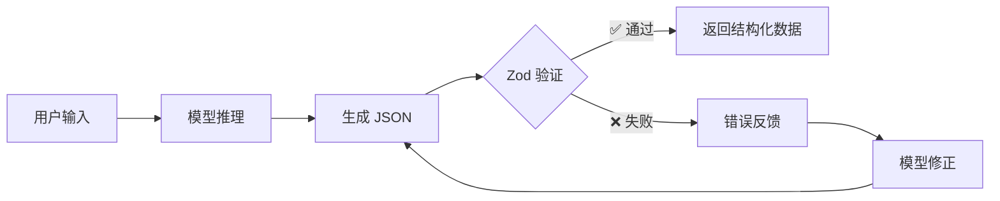

默认情况下，模型返回的是自由文本。但在很多场景下，你需要的是结构化数据——从一段文本中提取联系人信息、对用户反馈进行情感分类、生成符合特定格式的配置对象。deepseek-kit 的结构化输出功能让你通过 Zod Schema 定义期望的数据结构，模型会生成符合 Schema 的 JSON 数据，并经过自动验证和重试，确保返回类型安全的结果。

## 基本用法

通过 `output` 参数指定 Zod Schema，模型将返回符合该 Schema 的结构化数据：

```ts
import { createAgent, createModel } from 'deepseek-kit'
import { z } from 'zod'

const model = createModel({ model: 'deepseek-v4-flash' })

const agent = createAgent({
  model,
  output: {
    schema: z.object({
      name: z.string().describe('联系人姓名'),
      email: z.string().describe('邮箱地址'),
      phone: z.string().describe('电话号码'),
    }),
  },
})

const result = await agent.generate({
  prompt: '提取联系人信息：张三，zhangsan@example.com，13800138000',
})

console.log(result.output)
// { name: '张三', email: 'zhangsan@example.com', phone: '13800138000' }
```

你也可以直接在 `generateText` 中使用结构化输出：

```ts
import { createModel, generateText } from 'deepseek-kit'
import { z } from 'zod'

const model = createModel({ model: 'deepseek-v4-flash' })

const result = await generateText({
  model,
  output: {
    schema: z.object({
      sentiment: z.enum(['positive', 'negative', 'neutral']),
      confidence: z.number().min(0).max(1),
    }),
  },
  messages: [{ role: 'user', content: '这个产品太棒了，强烈推荐！' }],
})

console.log(result.output)
// { sentiment: 'positive', confidence: 0.95 }
```

## 它是如何工作的

deepseek-kit 的结构化输出采用**提示词 + JSON 模式 + 自动重试**的策略：

1. **构建提示词** — 将 Zod Schema 转换为 JSON Schema，并生成一条格式化提示词，要求模型输出符合该 Schema 的 JSON
2. **JSON 模式调用** — 使用 `response_format: { type: 'json_object' }` 调用模型，确保输出为合法 JSON
3. **验证解析** — 使用 Zod 的 `safeParse` 验证模型输出是否完全符合 Schema
4. **自动重试** — 如果验证失败，将格式化的错误信息反馈给模型，让它修正输出并重试



## 结合工具使用

结构化输出可以与工具同时使用。智能体会先通过多步循环调用工具获取信息，然后在最后一步生成结构化输出：

```ts
import { createAgent, createModel, tool } from 'deepseek-kit'
import { z } from 'zod'

const model = createModel({ model: 'deepseek-v4-flash' })

const weatherTool = tool({
  name: 'getWeather',
  description: '查询城市的天气信息',
  schema: z.object({
    city: z.string().describe('城市名称'),
  }),
  execute: async (input) => {
    return { city: input.city, temperature: 22, condition: '晴' }
  },
})

const agent = createAgent({
  model,
  tools: [weatherTool],
  output: {
    schema: z.object({
      city: z.string(),
      temperature: z.number(),
      condition: z.string(),
      recommendation: z.string(),
    }),
  },
})

const result = await agent.generate({
  prompt: '北京今天天气怎么样？需要带伞吗？',
})

console.log(result.output)
// { city: '北京', temperature: 22, condition: '晴', recommendation: '不需要带伞，天气晴好。' }
```

::callout{icon="lucide:info"}
结构化输出的生成会占用一个额外的步骤（step）。当与工具结合使用时，请确保 `maxSteps` 足够大，以容纳工具调用和最终的结构化输出步骤。
::

## 属性描述

使用 `.describe()` 为 Schema 属性添加描述，帮助模型理解每个字段的含义和期望格式，从而提高生成质量：

```ts
const agent = createAgent({
  model,
  output: {
    schema: z.object({
      name: z.string().describe('菜谱名称'),
      ingredients: z.array(
        z.object({
          name: z.string().describe('食材名称'),
          amount: z.string().describe('用量，如 200克、2汤匙'),
        }),
      ).describe('食材清单'),
      steps: z.array(z.string()).describe('烹饪步骤'),
    }),
  },
})

const result = await agent.generate({
  prompt: '生成一份番茄炒蛋的菜谱。',
})

console.log(result.output)
```

属性描述在以下场景中特别有用：

- 消除属性名的歧义（例如 `name` 是人名还是产品名？）
- 指定期望的格式或约定（例如日期格式、数值范围）
- 为复杂的嵌套结构提供上下文说明

## 嵌套结构

Schema 支持任意层级的嵌套，你可以定义复杂的数据结构：

```ts
const agent = createAgent({
  model,
  output: {
    schema: z.object({
      order: z.object({
        orderId: z.string(),
        customer: z.object({
          name: z.string(),
          address: z.object({
            city: z.string(),
            street: z.string(),
            zipCode: z.string(),
          }),
        }),
        items: z.array(z.object({
          productName: z.string(),
          quantity: z.number().int().positive(),
          price: z.number().positive(),
        })),
        totalAmount: z.number().positive(),
      }),
    }),
  },
})

const result = await agent.generate({
  prompt: '解析订单：订单号 ORD-001，客户李四，北京市朝阳区建国路88号 100022，购买了2本《JavaScript高级编程》每本89元，1个键盘每个299元。',
})

console.log(result.output)
```

## 枚举与联合类型

使用 Zod 的枚举和联合类型来约束输出值的范围：

```ts
const agent = createAgent({
  model,
  output: {
    schema: z.object({
      category: z.enum(['技术', '体育', '娱乐', '财经', '教育']),
      priority: z.enum(['high', 'medium', 'low']),
      tags: z.array(z.string()),
    }),
  },
})

const result = await agent.generate({
  prompt: '分类这篇文章：OpenAI 发布了新一代大语言模型...',
})

console.log(result.output)
// { category: '技术', priority: 'high', tags: ['AI', '大语言模型', 'OpenAI'] }
```

## 可选字段与默认值

使用 `.optional()` 和 `.default()` 处理可能缺失的字段：

```ts
const agent = createAgent({
  model,
  output: {
    schema: z.object({
      title: z.string(),
      summary: z.string(),
      author: z.string().optional(),
      publishDate: z.string().optional(),
      rating: z.number().min(1).max(5).default(3),
    }),
  },
})

const result = await agent.generate({
  prompt: '总结这篇文章的主要内容。',
})
```

## 自动重试与错误处理

当模型生成的 JSON 不符合 Schema 时，deepseek-kit 会自动进行重试：

### JSON 解析失败

如果模型输出了无效的 JSON，deepseek-kit 会提示模型重新输出合法 JSON：

```
模型输出: "这是结果：{ "name": "张三" }"  ← 包含多余文本
反馈: "Your previous output is not valid JSON. Please output only a valid JSON object..."
```

### Schema 验证失败

如果 JSON 合法但不符合 Schema，deepseek-kit 会将 Zod 验证错误格式化后反馈给模型：

```
模型输出: { "rating": 10 }  ← 超出 1-5 的范围
反馈: "Your previous JSON output does not conform to the required schema...
       - Field 'rating': Number must be less than or equal to 5"
```

默认最大重试次数为 3 次。达到上限后，如果输出仍然不符合 Schema，将抛出 `AgentError`：

```ts
import { createAgent, createModel } from 'deepseek-kit'
import { z } from 'zod'

const model = createModel({ model: 'deepseek-v4-flash' })

const agent = createAgent({
  model,
  output: {
    schema: z.object({
      code: z.string().regex(/^[A-Z]{3}-\d{4}$/, '格式应为 XXX-0000'),
    }),
  },
})

try {
  const result = await agent.generate({
    prompt: '生成一个编号。',
  })
}
catch (error) {
  if (error.type === 'schema_error') {
    console.error('结构化输出验证失败:', error.message)
  }
}
```

## 流式输出中的结构化数据

使用 `stream()` 方法时，结构化输出的生成过程会作为流事件推送。你可以在 `finish` 事件中获取最终的文本结果：

```ts
const stream = agent.stream({
  prompt: '提取联系人信息：李四，lisi@example.com',
})

for await (const event of stream) {
  switch (event.type) {
    case 'text-delta':
      process.stdout.write(event.textDelta)
      break
    case 'tool-call':
      console.log(`\n调用工具: ${event.toolCalls.map(t => t.function.name).join(', ')}`)
      break
    case 'step':
      console.log(`\n步骤 ${event.step}`)
      break
    case 'finish':
      console.log('\n完成！')
      break
  }
}
```

## 生命周期 Hook

结构化输出的生成步骤同样会触发生命周期 Hook。在 `afterStep` 中，步骤类型为 `'format'`，你可以借此追踪结构化输出的生成过程：

```ts
const agent = createAgent({
  model,
  output: {
    schema: z.object({ name: z.string(), email: z.string() }),
  },
  hooks: {
    afterStep: (step) => {
      if (step.type === 'format') {
        console.log(`结构化输出步骤 ${step.step} 完成`)
      }
    },
  },
})
```

## API 参考

### output 参数

::field-group
  ::field{name="schema" type="z.ZodTypeAny" required}
  定义结构化输出格式的 Zod Schema。模型将生成符合此 Schema 的 JSON 数据，并经过验证后返回。
  ::
::

### GenerateTextResult 类型

::field-group
  ::field{name="text" type="string"}
  模型生成的文本内容。当使用结构化输出时，此字段包含原始 JSON 字符串。
  ::

  ::field{name="output" type="z.infer<T>"}
  经过 Schema 验证的结构化输出数据。类型由传入的 Zod Schema 自动推断。未指定 `output` 时为 `undefined`。
  ::

  ::field{name="usage" type="Usage"}
  Token 使用量统计，包括 prompt_tokens、completion_tokens 和 total_tokens。
  ::
::

### StepEvent 类型（结构化输出步骤）

::field-group
  ::field{name="step" type="number"}
  当前步骤编号。
  ::

  ::field{name="type" type="'format'"}
  步骤类型。结构化输出步骤的类型为 `'format'`。
  ::

  ::field{name="usage" type="Usage"}
  当前步骤的 Token 使用量。
  ::

  ::field{name="text" type="string"}
  当前步骤生成的原始文本（JSON 字符串）。
  ::

  ::field{name="reasoningContent" type="string"}
  推理内容（思考模式启用时可用）。
  ::
::

### AgentError 类型（结构化输出错误）

::field-group
  ::field{name="type" type="'schema_error'"}
  错误类型。结构化输出验证失败时为 `'schema_error'`。
  ::

  ::field{name="message" type="string"}
  错误描述信息，包含最后一次模型输出的摘要。
  ::

  ::field{name="step" type="number"}
  发生错误时的步骤编号。
  ::

  ::field{name="retryable" type="false"}
  是否可重试。结构化输出错误标记为不可重试。
  ::
::
