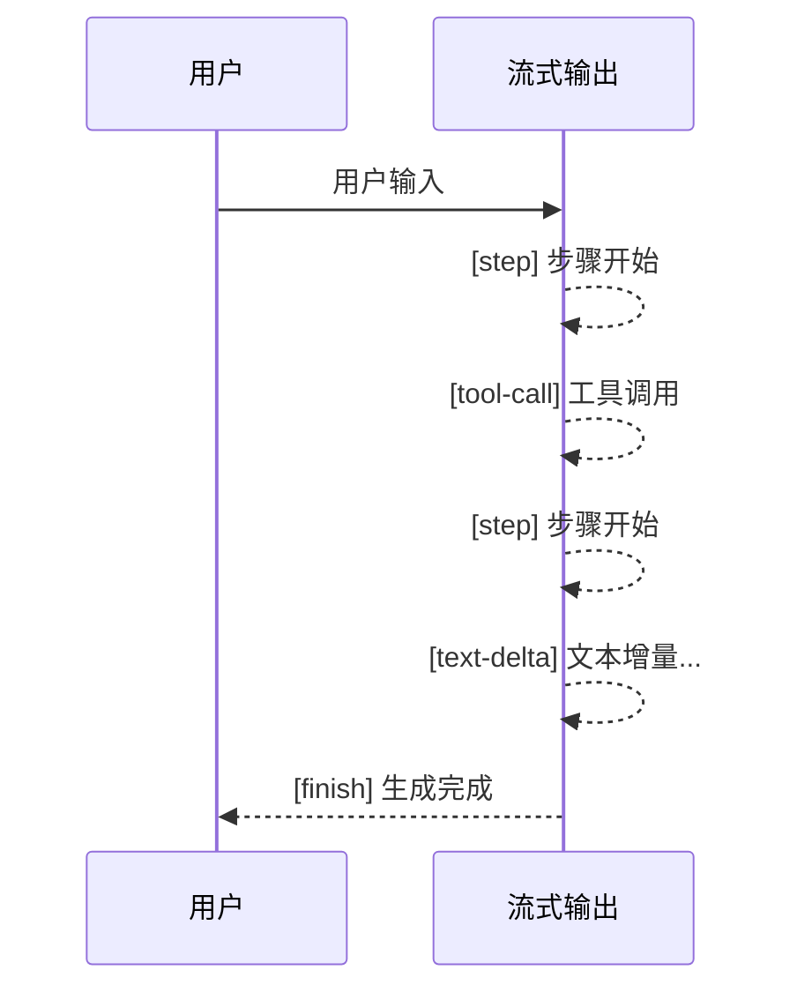

大语言模型生成长文本时可能需要数秒甚至数十秒。如果使用传统的阻塞式调用，用户只能盯着加载动画等待完整响应。流式输出通过**逐段推送生成内容**，让用户几乎实时看到模型的输出，大幅提升交互体验。deepseek-kit 通过 `agent.stream()` 提供了简洁的流式 API，支持文本增量、推理增量、工具调用等多种事件类型。

## 基本用法

使用 `agent.stream()` 替代 `agent.generate()`，即可获得流式输出。`stream()` 返回一个异步迭代器，你可以通过 `for await...of` 逐个消费流事件：

```ts
import { createAgent, createModel } from 'deepseek-kit'

const model = createModel({ model: 'deepseek-v4-flash' })

const agent = createAgent({ model })

const stream = agent.stream({
  prompt: '用三段话介绍量子计算的基本原理。',
})

for await (const event of stream) {
  switch (event.type) {
    case 'text-delta':
      process.stdout.write(event.textDelta)
      break
    case 'finish':
      console.log('\n--- 生成完成 ---')
      break
  }
}
```

`text-delta` 事件携带一小段文本增量，你可以将其直接追加到 UI 中，实现逐字显示的效果。

## 流事件类型

deepseek-kit 定义了五种流事件类型，覆盖了智能体运行过程中的所有关键节点：

### text-delta — 文本增量

模型每生成一小段文本，就会触发一个 `text-delta` 事件。这是最常用的事件类型，用于实时显示模型的文本输出：

```ts
case 'text-delta':
  process.stdout.write(event.textDelta)
  break
```

### reasoning-delta — 推理增量

当模型启用思考模式时，推理过程会以 `reasoning-delta` 事件推送。你可以借此展示模型的"思考过程"：

```ts
case 'reasoning-delta':
  process.stdout.write(`[思考] ${event.reasoningDelta}`)
  break
```

::callout{icon="lucide:info"}
`reasoning-delta` 仅在模型返回 `reasoning_content` 字段时可用，需要模型和配置支持思考模式。
::

### tool-call — 工具调用

当智能体调用工具时，`tool-call` 事件会在工具执行完毕后触发，携带该步骤中所有工具调用的信息：

```ts
case 'tool-call':
  console.log(`步骤 ${event.step} 调用工具:`)
  for (const tc of event.toolCalls) {
    console.log(`  - ${tc.function.name}(${tc.function.arguments})`)
  }
  break
```

### step — 步骤开始

每个新步骤开始时触发，携带步骤编号。你可以用它来追踪智能体的执行进度：

```ts
case 'step':
  console.log(`\n[步骤 ${event.step}]`)
  break
```

### finish — 生成完成

智能体完成所有步骤后触发，携带最终的完整文本和 Token 使用量：

```ts
case 'finish':
  console.log('生成完成')
  console.log(`Token 使用量: ${event.usage?.total_tokens}`)
  break
```

## 完整事件处理

以下示例展示了如何处理所有事件类型，构建一个完整的流式输出体验：

```ts
import { createAgent, createModel, tool } from 'deepseek-kit'
import { z } from 'zod'

const model = createModel({ model: 'deepseek-v4-flash' })

const weatherTool = tool({
  name: 'getWeather',
  description: '查询城市的天气信息',
  schema: z.object({ city: z.string().describe('城市名称') }),
  execute: async (input) => {
    return `${input.city} 今日天气晴，温度22摄氏度。`
  },
})

const agent = createAgent({
  model,
  tools: [weatherTool],
})

const stream = agent.stream({
  prompt: '北京今天天气怎么样？',
})

for await (const event of stream) {
  switch (event.type) {
    case 'step':
      console.log(`\n=== 步骤 ${event.step} ===`)
      break
    case 'text-delta':
      process.stdout.write(event.textDelta)
      break
    case 'reasoning-delta':
      process.stdout.write(`[思考] ${event.reasoningDelta}`)
      break
    case 'tool-call':
      console.log(`\n调用工具: ${event.toolCalls.map(t => t.function.name).join(', ')}`)
      break
    case 'finish':
      console.log('\n=== 完成 ===')
      if (event.usage) {
        console.log(`总 Token: ${event.usage.total_tokens}`)
      }
      break
  }
}
```

输出示例：

```
=== 步骤 1 ===
调用工具: getWeather
=== 步骤 2 ===
北京今日天气晴，温度22摄氏度。
=== 完成 ===
总 Token: 256
```

## 流式输出与工具调用

当智能体配备工具时，流式输出会自动包含工具调用事件。整个流程如下：

1. **步骤 1** — 模型推理后决定调用工具，触发 `step` → `tool-call` 事件
2. **步骤 2** — 模型基于工具结果生成最终回复，触发 `step` → `text-delta` → `finish` 事件



你可以在 UI 中根据事件类型切换显示状态——工具调用时显示"正在查询..."，文本增量时逐字显示结果：

```ts
for await (const event of stream) {
  switch (event.type) {
    case 'tool-call':
      for (const tc of event.toolCalls) {
        console.log(`🔍 正在调用 ${tc.function.name}...`)
      }
      break
    case 'text-delta':
      process.stdout.write(event.textDelta)
      break
    case 'finish':
      console.log('\n✅ 完成')
      break
  }
}
```

## 流式输出与结构化输出

当智能体配置了 `output` 参数时，结构化输出的生成步骤也会通过流事件推送。结构化输出步骤中，`text-delta` 事件携带的是 JSON 文本增量。最终的解析结果需要通过 `agent.generate()` 获取：

```ts
const agent = createAgent({
  model,
  tools: [weatherTool],
  output: {
    schema: z.object({
      city: z.string(),
      temperature: z.number(),
      recommendation: z.string(),
    }),
  },
})

const stream = agent.stream({
  prompt: '北京天气怎么样？需要带伞吗？',
})

for await (const event of stream) {
  switch (event.type) {
    case 'text-delta':
      process.stdout.write(event.textDelta)
      break
    case 'tool-call':
      console.log(`\n调用工具: ${event.toolCalls.map(t => t.function.name).join(', ')}`)
      break
    case 'finish':
      console.log('\n完成！')
      break
  }
}
```

## 中止流式输出

通过 `AbortSignal` 可以中止正在进行的流式输出：

```ts
const controller = new AbortController()

const stream = agent.stream({
  prompt: '写一篇长文...',
  signal: controller.signal,
})

setTimeout(() => controller.abort(), 5000)

for await (const event of stream) {
  if (event.type === 'text-delta') {
    process.stdout.write(event.textDelta)
  }
}
```

5 秒后流式输出将被中止，已接收的内容仍然可用。

## 流式 vs 非流式

| 特性 | `agent.generate()` | `agent.stream()` |
|------|-------------------|-------------------|
| 返回方式 | 等待完整结果后一次性返回 | 逐事件实时推送 |
| 返回类型 | `Promise<GenerateTextResult>` | `AsyncGenerator<StreamEvent>` |
| 适用场景 | 后台任务、批处理 | 聊天界面、实时交互 |
| 工具调用 | 自动处理，返回最终结果 | 通过 `tool-call` 事件实时通知 |
| Token 统计 | 在结果中返回 | 在 `finish` 事件中返回 |

选择建议：

- **需要实时反馈** — 使用 `stream()`，如聊天应用、交互式工具
- **只需最终结果** — 使用 `generate()`，如批处理、API 后端

## API 参考

### agent.stream() 参数

::field-group
  ::field{name="prompt" type="string"}
  用户输入的提示词。
  ::

  ::field{name="messages" type="ChatMessage[]"}
  对话消息数组。与 `prompt` 二选一。
  ::
::

### StreamEvent 类型

::field-group
  ::field{name="text-delta" type="TextDeltaStreamEvent"}
  文本增量事件。包含 `textDelta` 字段，携带一小段生成的文本。
  ::

  ::field{name="reasoning-delta" type="ReasoningDeltaStreamEvent"}
  推理增量事件。包含 `reasoningDelta` 字段，携带模型的思考过程片段（思考模式启用时可用）。
  ::

  ::field{name="tool-call" type="ToolCallStreamEvent"}
  工具调用事件。包含 `step`（步骤编号）和 `toolCalls`（工具调用数组）字段。
  ::

  ::field{name="step" type="StepStreamEvent"}
  步骤开始事件。包含 `step`（步骤编号）字段。
  ::

  ::field{name="finish" type="FinishStreamEvent"}
  完成事件。包含 `text`（完整文本）和 `usage`（Token 使用量）字段。
  ::
::

### TextDeltaStreamEvent

::field-group
  ::field{name="type" type="'text-delta'"}
  事件类型标识。
  ::

  ::field{name="textDelta" type="string"}
  本次增量文本片段。
  ::
::

### ReasoningDeltaStreamEvent

::field-group
  ::field{name="type" type="'reasoning-delta'"}
  事件类型标识。
  ::

  ::field{name="reasoningDelta" type="string"}
  本次推理增量片段。
  ::
::

### ToolCallStreamEvent

::field-group
  ::field{name="type" type="'tool-call'"}
  事件类型标识。
  ::

  ::field{name="step" type="number"}
  当前步骤编号。
  ::

  ::field{name="toolCalls" type="ChatCompletionTool[]"}
  本次步骤中的工具调用列表。每项包含 `id`、`function.name` 和 `function.arguments`。
  ::
::

### StepStreamEvent

::field-group
  ::field{name="type" type="'step'"}
  事件类型标识。
  ::

  ::field{name="step" type="number"}
  步骤编号。
  ::
::

### FinishStreamEvent

::field-group
  ::field{name="type" type="'finish'"}
  事件类型标识。
  ::

  ::field{name="text" type="string"}
  生成的完整文本。
  ::

  ::field{name="usage" type="Usage"}
  Token 使用量统计，包含 `prompt_tokens`、`completion_tokens` 和 `total_tokens`。
  ::
::
