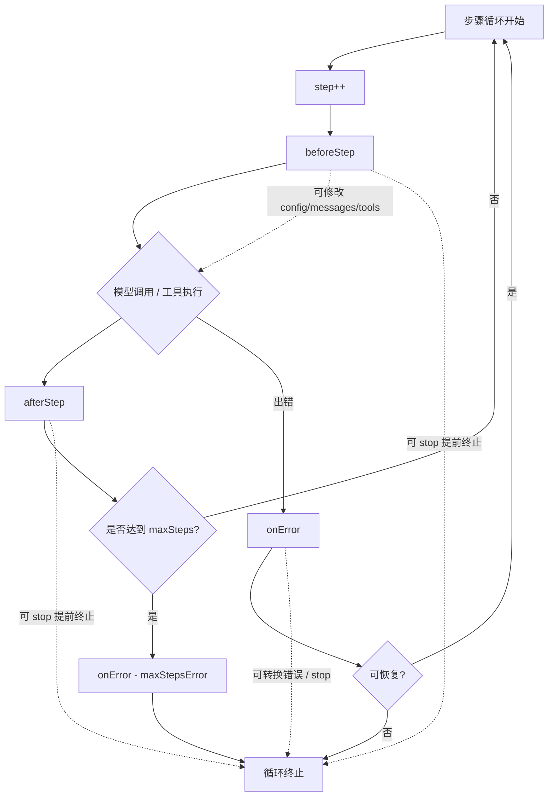

智能体在执行过程中会经历多个步骤——模型推理、工具调用、结构化输出。Hooks 让你在这个流程的关键节点插入自定义逻辑，无需修改核心代码即可实现日志记录、动态配置、流程控制和错误处理。无论是追踪每一步的执行状态，还是根据运行时条件切换模型，Hooks 都提供了简洁而强大的扩展机制。

## 三个 Hook

deepseek-kit 提供三个生命周期 Hook，覆盖智能体执行的完整流程：

| Hook | 触发时机 | 典型用途 |
|------|---------|---------|
| `beforeStep` | 每个步骤开始前 | 日志记录、动态修改配置、提前终止 |
| `afterStep` | 每个步骤完成后 | 日志记录、结果追踪、提前终止 |
| `onError` | 步骤执行出错时 | 错误处理、自定义错误转换 |

```ts
import { createAgent, createModel } from 'deepseek-kit'

const model = createModel({ model: 'deepseek-v4-flash' })

const agent = createAgent({
  model,
  hooks: {
    beforeStep: (context, hookCtx) => {
      console.log(`步骤 ${context.step} 开始`)
    },
    afterStep: (step, hookCtx) => {
      console.log(`步骤 ${step.step} 完成: ${step.type}`)
    },
    onError: (error, hookCtx) => {
      console.error(`步骤出错: ${error.type} - ${error.message}`)
    },
  },
})
```

## beforeStep — 步骤前拦截

`beforeStep` 在每个步骤开始前调用，接收当前步骤的上下文信息和 HookContext。你可以用它来：

- 记录执行进度
- 动态修改当前步骤的配置
- 替换当前步骤的消息或工具
- 提前终止循环

### 参数

`beforeStep` 接收两个参数：

1. **`context`** — 当前步骤的上下文信息
2. **`hookCtx`** — Hook 上下文，提供 `stop()` 方法

### 日志记录

最简单的用法是记录每个步骤的开始：

```ts
beforeStep: (context, hookCtx) => {
  console.log(`步骤 ${context.step} 开始，当前 ${context.messages.length} 条消息`)
}
```

### 动态修改配置

`beforeStep` 可以返回一个对象来修改当前步骤的配置。返回的对象会与默认配置合并：

```ts
beforeStep: (context, hookCtx) => {
  if (context.step > 5) {
    return {
      config: {
        model: 'deepseek-v4-pro',
      },
    }
  }
}
```

这会让智能体在第 6 步后切换到 Pro 模型。可修改的配置项包括：

- **`config`** — 模型配置（model、temperature、maxTokens 等）
- **`messages`** — 当前步骤的消息列表
- **`tools`** — 当前步骤可用的工具列表

### 动态选择工具

根据步骤编号或上下文动态调整可用工具：

```ts
beforeStep: (context, hookCtx) => {
  if (context.step === 1) {
    return {
      tools: [searchTool],
    }
  }
  return {
    tools: [searchTool, calculatorTool, weatherTool],
  }
}
```

### 修改消息

在特定步骤前注入额外消息：

```ts
beforeStep: (context, hookCtx) => {
  if (context.step === 3) {
    return {
      messages: [
        ...context.messages,
        { role: 'system', content: '请在回答中引用数据来源。' },
      ],
    }
  }
}
```

### 提前终止

通过 `hookCtx.stop()` 可以在任何 Hook 中提前终止智能体的执行循环：

```ts
beforeStep: (context, hookCtx) => {
  if (context.step > 10) {
    hookCtx.stop()
  }
}
```

调用 `stop()` 后，智能体会立即结束循环并返回当前已有的结果。这在需要设置自定义终止条件时非常有用。

## afterStep — 步骤后处理

`afterStep` 在每个步骤完成后调用，接收步骤结果和 HookContext。步骤的类型决定了结果中包含哪些信息：

### 步骤类型

| 类型 | 说明 | 可用字段 |
|------|------|---------|
| `'tool'` | 工具调用步骤 | `toolCalls`、`text`、`usage` |
| `'text'` | 文本生成步骤 | `text`、`usage` |
| `'format'` | 结构化输出步骤 | `text`、`usage` |

### 日志记录

记录每个步骤的执行结果：

```ts
afterStep: (step, hookCtx) => {
  console.log(`步骤 ${step.step} 完成: ${step.type}`)

  if (step.type === 'tool' && step.toolCalls) {
    console.log(`  调用工具: ${step.toolCalls.map(t => t.function.name).join(', ')}`)
  }

  if (step.type === 'text') {
    console.log(`  生成文本: ${step.text?.substring(0, 50)}...`)
  }

  console.log(`  Token 使用: ${step.usage.total_tokens}`)
}
```

### Token 用量追踪

通过 `afterStep` 累计追踪 Token 消耗：

```ts
let totalTokens = 0

afterStep: (step, hookCtx) => {
  totalTokens += step.usage.total_tokens
  console.log(`累计 Token: ${totalTokens}`)
}
```

### 工具调用监控

专门监控工具调用步骤：

```ts
afterStep: (step, hookCtx) => {
  if (step.type === 'tool' && step.toolCalls) {
    for (const tc of step.toolCalls) {
      console.log(`[工具调用] ${tc.function.name}`)
      console.log(`  参数: ${tc.function.arguments}`)
    }
  }
}
```

### 提前终止

`afterStep` 同样支持通过 `hookCtx.stop()` 提前终止：

```ts
afterStep: (step, hookCtx) => {
  if (step.type === 'tool' && step.toolCalls) {
    const names = step.toolCalls.map(t => t.function.name)
    if (names.includes('dangerousAction')) {
      hookCtx.stop()
    }
  }
}
```

## onError — 错误处理

`onError` 在步骤执行出错时调用，接收 `AgentError` 和 HookContext。你可以用它来：

- 记录错误信息
- 自定义错误转换
- 根据错误类型决定是否继续执行

### 错误类型

`AgentError` 包含一个 `type` 字段，标识错误的类别：

| 类型 | 说明 | 可重试 |
|------|------|--------|
| `'rate_limit'` | API 速率限制 | ✅ |
| `'model_error'` | 模型返回错误 | ✅ |
| `'timeout'` | 请求超时 | ✅ |
| `'network_error'` | 网络连接错误 | ✅ |
| `'tool_error'` | 工具执行错误 | ❌ |
| `'max_steps'` | 达到最大步数 | ❌ |
| `'schema_error'` | 结构化输出验证失败 | ❌ |

### 日志记录

记录错误信息用于调试：

```ts
onError: (error, hookCtx) => {
  console.error(`[错误] 步骤 ${error.step}: ${error.type} - ${error.message}`)
  if (error.retryable) {
    console.log('  此错误可重试')
  }
}
```

### 自定义错误转换

`onError` 可以返回一个新的 `AgentError` 来替换原始错误，或者返回 `undefined` 来抑制错误（让循环继续）：

```ts
onError: (error, hookCtx) => {
  if (error.type === 'rate_limit') {
    console.log('遇到速率限制，将自动重试...')
    return undefined
  }

  if (error.type === 'network_error') {
    return new AgentError({
      message: '网络连接失败，请检查网络设置后重试。',
      type: 'network_error',
      step: error.step,
      retryable: false,
    })
  }

  return error
}
```

返回值规则：

- **返回 `undefined`** — 抑制错误，循环继续执行下一步
- **返回 `AgentError`** — 用新的错误替换原始错误；如果 `hookCtx.stop()` 被调用，循环终止
- **不返回值（void）** — 原始错误继续抛出

### 提前终止

在 `onError` 中结合 `hookCtx.stop()` 可以在遇到特定错误时优雅终止：

```ts
onError: (error, hookCtx) => {
  if (error.type === 'max_steps') {
    console.log('已达到最大步数限制，提前终止。')
    hookCtx.stop()
    return
  }

  if (!error.retryable) {
    console.error(`不可重试的错误: ${error.message}`)
    hookCtx.stop()
  }
}
```

## 组合使用

三个 Hook 通常组合使用，构建完整的可观测性和控制逻辑：

### 完整日志中间件

```ts
const agent = createAgent({
  model,
  tools: [weatherTool, searchTool],
  hooks: {
    beforeStep: (context, hookCtx) => {
      console.log(`\n--- 步骤 ${context.step} ---`)
      console.log(`消息数: ${context.messages.length}`)
      console.log(`可用工具: ${context.tools.map(t => t.name).join(', ')}`)
    },
    afterStep: (step, hookCtx) => {
      if (step.type === 'tool') {
        console.log(`工具调用: ${step.toolCalls?.map(t => t.function.name).join(', ')}`)
      }
      else if (step.type === 'text') {
        console.log(`生成文本 (${step.text?.length} 字符)`)
      }
      console.log(`Token: ${step.usage.total_tokens}`)
    },
    onError: (error, hookCtx) => {
      console.error(`错误: [${error.type}] ${error.message}`)
      if (!error.retryable) {
        hookCtx.stop()
      }
    },
  },
})
```

### 动态模型切换

根据步骤进度动态切换模型——前期使用快速模型，后期切换到高精度模型：

```ts
const fastModel = createModel({ model: 'deepseek-v4-flash' })
const proModel = createModel({ model: 'deepseek-v4-pro' })

const agent = createAgent({
  model: fastModel,
  tools: [searchTool, analysisTool],
  hooks: {
    beforeStep: (context, hookCtx) => {
      if (context.step >= 3) {
        return {
          config: {
            model: 'deepseek-v4-pro',
          },
        }
      }
    },
    afterStep: (step, hookCtx) => {
      console.log(`步骤 ${step.step} (${step.type}), Token: ${step.usage.total_tokens}`)
    },
  },
})
```

### 步数限制与优雅降级

当步骤过多时优雅终止，而不是直接抛出错误：

```ts
const agent = createAgent({
  model,
  tools: [searchTool],
  maxSteps: 20,
  hooks: {
    beforeStep: (context, hookCtx) => {
      if (context.step > 10) {
        console.log(`步骤 ${context.step} 超过建议限制，准备终止。`)
        hookCtx.stop()
      }
    },
    onError: (error, hookCtx) => {
      if (error.type === 'max_steps') {
        console.log('达到最大步数，返回已有结果。')
        hookCtx.stop()
      }
    },
  },
})
```

### Token 预算控制

设置 Token 预算，超出预算时提前终止：

```ts
let totalTokens = 0
const TOKEN_BUDGET = 10000

const agent = createAgent({
  model,
  tools: [searchTool],
  hooks: {
    afterStep: (step, hookCtx) => {
      totalTokens += step.usage.total_tokens
      if (totalTokens > TOKEN_BUDGET) {
        console.log(`Token 预算已用尽 (${totalTokens}/${TOKEN_BUDGET})，提前终止。`)
        hookCtx.stop()
      }
    },
  },
})
```

## 执行流程

以下是 Hooks 在智能体循环中的触发时机：



::callout{icon="lucide:info"}
`beforeStep` 和 `afterStep` 也会在结构化输出步骤中触发，此时步骤类型为 `'format'`。结构化输出的重试过程中，每次重试都会触发 Hook。
::

## API 参考

### GenerateTextHooks

::field-group
  ::field{name="beforeStep" type="(context: BeforeStepContext, hookCtx: HookContext) => BeforeStepResult | void"}
  步骤开始前的 Hook。接收当前步骤上下文和 Hook 上下文，可返回配置修改对象。
  ::

  ::field{name="afterStep" type="(step: StepEvent, hookCtx: HookContext) => void"}
  步骤完成后的 Hook。接收步骤结果和 Hook 上下文。
  ::

  ::field{name="onError" type="(error: AgentError, hookCtx: HookContext) => void | AgentError | Promise<AgentError | void>"}
  错误处理 Hook。接收错误对象和 Hook 上下文。可返回 `undefined` 抑制错误，或返回新的 `AgentError` 替换原始错误。
  ::
::

### BeforeStepContext

::field-group
  ::field{name="step" type="number"}
  当前步骤编号（从 1 开始）。
  ::

  ::field{name="config" type="ModelOptions"}
  当前模型的配置信息，包括 model、temperature、maxTokens 等。
  ::

  ::field{name="messages" type="ChatMessage[]"}
  当前步骤的消息列表副本。修改返回值中的 `messages` 可替换当前步骤的消息。
  ::

  ::field{name="tools" type="Tool[]"}
  当前步骤可用的工具列表。修改返回值中的 `tools` 可替换当前步骤的工具。
  ::
::

### BeforeStepResult

::field-group
  ::field{name="messages" type="ChatMessage[]"}
  替换当前步骤的消息列表。
  ::

  ::field{name="tools" type="Tool[]"}
  替换当前步骤的工具列表。
  ::

  ::field{name="config" type="Partial<ModelOptions>"}
  修改当前步骤的模型配置。支持的字段包括 `model`、`temperature`、`maxTokens`、`thinking` 等。
  ::
::

### StepEvent

::field-group
  ::field{name="step" type="number"}
  步骤编号。
  ::

  ::field{name="type" type="'tool' | 'text' | 'format'"}
  步骤类型。`'tool'` 表示工具调用步骤，`'text'` 表示文本生成步骤，`'format'` 表示结构化输出步骤。
  ::

  ::field{name="usage" type="Usage"}
  当前步骤的 Token 使用量。
  ::

  ::field{name="toolCalls" type="ChatCompletionTool[]"}
  工具调用列表（仅 `'tool'` 类型步骤可用）。
  ::

  ::field{name="text" type="string"}
  生成的文本内容。
  ::

  ::field{name="reasoningContent" type="string"}
  推理内容（思考模式启用时可用）。
  ::
::

### HookContext

::field-group
  ::field{name="stop" type="() => void"}
  终止智能体的执行循环。调用后，智能体会立即结束并返回当前已有的结果。
  ::
::

### AgentError

::field-group
  ::field{name="type" type="AgentErrorType"}
  错误类型。可选值为 `'rate_limit'`、`'model_error'`、`'timeout'`、`'network_error'`、`'tool_error'`、`'max_steps'`、`'schema_error'`。
  ::

  ::field{name="message" type="string"}
  错误描述信息。
  ::

  ::field{name="step" type="number"}
  发生错误时的步骤编号。
  ::

  ::field{name="retryable" type="boolean"}
  是否可重试。`'rate_limit'`、`'model_error'`、`'timeout'`、`'network_error'` 类型的错误默认可重试。
  ::

  ::field{name="cause" type="Error"}
  原始错误对象。
  ::
::
