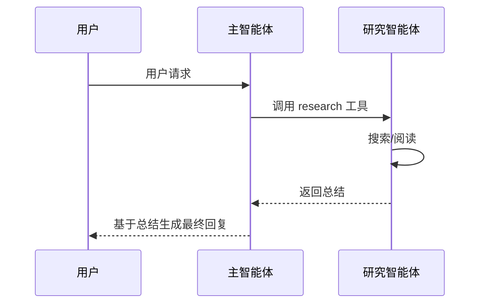

当单个智能体的任务过于复杂，或者你需要将不同能力隔离给专门的智能体时，子智能体就派上用场了。子智能体的核心思路很简单：**将一个智能体封装为工具，让另一个智能体调用它**。主智能体负责编排和决策，子智能体在独立的上下文窗口中自主执行，最终只返回精炼的结果。这种模式既能处理需要大量上下文探索的任务，又能保持主智能体的上下文干净和聚焦。

## 何时使用子智能体

子智能体增加了延迟和复杂度，请根据实际需求权衡：

| 适合使用 | 不建议使用 |
|---------|-----------|
| 任务需要探索大量上下文 | 任务简单且聚焦 |
| 需要并行处理独立的研究工作 | 顺序处理即可满足 |
| 上下文可能超出模型限制 | 上下文始终可控 |
| 需要按能力隔离工具访问 | 所有工具可以安全共存 |

## 基本用法

子智能体的实现模式非常直接：定义一个智能体，然后将它封装为工具，供主智能体调用：

```ts
import { createAgent, createModel, tool } from 'deepseek-kit'
import { z } from 'zod'

const model = createModel({ model: 'deepseek-v4-flash' })

const researchAgent = createAgent({
  model,
  system: '你是一个研究助手。深入调查任务，并在最终回复中清晰总结你的发现。',
  tools: [searchTool, readFileTool],
})

const researchTool = tool({
  name: 'research',
  description: '深入研究一个主题或问题',
  schema: z.object({
    task: z.string().describe('需要研究的任务'),
  }),
  execute: async (input) => {
    const result = await researchAgent.generate({
      prompt: input.task,
    })
    return result.text
  },
})

const mainAgent = createAgent({
  model,
  system: '你是一个助手，可以将研究任务委派给专门的研究智能体。',
  tools: [researchTool],
})

const result = await mainAgent.generate({
  messages: [{ role: 'user', content: '帮我研究量子计算在密码学中的影响。' }],
})

console.log(result.text)
```

执行流程：

1. 主智能体收到用户请求，判断需要深入研究
2. 主智能体调用 `research` 工具，传入研究任务
3. 研究智能体在独立的上下文中自主执行（可能多次调用搜索、阅读工具）
4. 研究智能体返回总结结果
5. 主智能体基于研究结果生成最终回复



## 上下文隔离

子智能体的核心优势在于**上下文隔离**。每次调用子智能体时，它会启动一个全新的上下文窗口——不继承主智能体的对话历史。这意味着：

- 子智能体可以使用数十万 Token 进行探索，而不会污染主智能体的上下文
- 主智能体只接收子智能体返回的精炼结果
- 多次调用子智能体不会导致上下文膨胀

```ts
const researchTool = tool({
  name: 'research',
  description: '深入研究一个主题',
  schema: z.object({ task: z.string() }),
  execute: async (input) => {
    const result = await researchAgent.generate({
      messages: [{ role: 'user', content: input.task }],
    })
    return result.text
  },
})
```

子智能体可能消耗 100,000 Token 进行探索和推理，但主智能体只消耗返回的摘要文本——可能只有 1,000 Token。

## 传递对话历史

默认情况下，子智能体不继承主智能体的对话历史。如果需要让子智能体了解之前的对话上下文，可以手动传递 `messages`：

```ts
const researchTool = tool({
  name: 'research',
  description: '结合对话上下文研究一个主题',
  schema: z.object({ task: z.string() }),
  execute: async (input) => {
    const result = await researchAgent.generate({
      messages: [
        ...currentMessages,
        { role: 'user', content: input.task },
      ],
    })
    return result.text
  },
})
```

::callout{icon="lucide:info"}
传递完整对话历史会削弱上下文隔离的优势。请谨慎使用，仅在子智能体确实需要了解对话背景时才传递。
::

## 并行子智能体

当多个研究任务相互独立时，可以在一个工具中并行启动多个子智能体，显著减少总延迟：

```ts
import { createAgent, createModel, tool } from 'deepseek-kit'
import { z } from 'zod'

const model = createModel({ model: 'deepseek-v4-flash' })

const researchAgent = createAgent({
  model,
  system: '你是一个研究助手。深入调查任务，并在最终回复中清晰总结你的发现。',
  tools: [searchTool],
})

const compareTool = tool({
  name: 'compareTopics',
  description: '并行研究多个主题并返回对比结果',
  schema: z.object({
    topics: z.array(z.string()).describe('需要对比研究的主题列表'),
  }),
  execute: async (input) => {
    const results = await Promise.all(
      input.topics.map(topic =>
        researchAgent.generate({ prompt: `请深入研究以下主题并总结：${topic}` }),
      ),
    )
    return results.map((r, i) => `## ${input.topics[i]}\n${r.text}`).join('\n\n')
  },
})

const mainAgent = createAgent({
  model,
  system: '你是一个助手，可以并行研究多个主题并进行对比分析。',
  tools: [compareTool],
})

const result = await mainAgent.generate({
  messages: [{ role: 'user', content: '对比 Python、JavaScript 和 Rust 在 Web 开发中的优劣。' }],
})
```

并行模式下，三个子智能体同时执行，总延迟取决于最慢的那个，而非三者之和。

## 专业化子智能体

为不同类型的任务创建专门的子智能体，每个子智能体拥有自己的模型、系统提示词和工具集：

```ts
import { createAgent, createModel, tool } from 'deepseek-kit'
import { z } from 'zod'

const fastModel = createModel({ model: 'deepseek-v4-flash' })
const proModel = createModel({ model: 'deepseek-v4-pro' })

const codeAgent = createAgent({
  model: proModel,
  system: '你是一个代码专家。只负责编写和修改代码，始终输出完整的代码块。',
  tools: [readFileTool, writeFileTool],
})

const reviewAgent = createAgent({
  model: proModel,
  system: '你是一个代码审查专家。审查代码质量、安全性和性能问题，给出具体的改进建议。',
  tools: [readFileTool],
})

const codeTool = tool({
  name: 'writeCode',
  description: '编写或修改代码',
  schema: z.object({ task: z.string().describe('代码任务描述') }),
  execute: async (input) => {
    const result = await codeAgent.generate({ prompt: input.task })
    return result.text
  },
})

const reviewTool = tool({
  name: 'reviewCode',
  description: '审查代码质量',
  schema: z.object({ code: z.string().describe('需要审查的代码') }),
  execute: async (input) => {
    const result = await reviewAgent.generate({ prompt: `审查以下代码：\n${input.code}` })
    return result.text
  },
})

const mainAgent = createAgent({
  model: fastModel,
  system: '你是一个开发助手，可以编写代码和审查代码。先编写代码，再审查代码，最后给出改进版本。',
  tools: [codeTool, reviewTool],
})
```

这种模式的优势：

- **工具隔离** — 代码智能体拥有写文件权限，审查智能体只有只读权限
- **模型选择** — 不同任务使用不同能力的模型
- **提示词专注** — 每个子智能体的系统提示词针对其职责优化

## 流式输出中的子智能体

子智能体的执行过程会作为主智能体工具调用的一部分。在流式输出中，你可以在 `tool-call` 事件中观察到子智能体被触发：

```ts
const stream = mainAgent.stream({
  prompt: '帮我研究量子计算的应用前景。',
})

for await (const event of stream) {
  switch (event.type) {
    case 'text-delta':
      process.stdout.write(event.textDelta)
      break
    case 'tool-call':
      console.log(`\n调用子智能体: ${event.toolCalls.map(t => t.function.name).join(', ')}`)
      break
    case 'finish':
      console.log('\n完成！')
      break
  }
}
```

注意：子智能体内部的执行过程（包括它的工具调用和文本生成）不会作为主智能体的流事件推送。主智能体只会在子智能体完成后收到最终结果。

## 中止子智能体

通过 `AbortSignal` 可以中止正在执行的子智能体。当主智能体的请求被取消时，信号会传播到子智能体：

```ts
const researchTool = tool({
  name: 'research',
  description: '深入研究一个主题',
  schema: z.object({ task: z.string() }),
  execute: async (input) => {
    const controller = new AbortController()

    const timeoutId = setTimeout(() => controller.abort(), 30000)

    try {
      const result = await researchAgent.generate({
        prompt: input.task,
        signal: controller.signal,
      })
      return result.text
    }
    finally {
      clearTimeout(timeoutId)
    }
  },
})
```

## 子智能体与结构化输出

子智能体同样支持结构化输出。你可以让子智能体返回符合特定 Schema 的结构化数据，而不是自由文本：

```ts
const sentimentAgent = createAgent({
  model,
  system: '你是一个情感分析专家。',
  output: {
    schema: z.object({
      sentiment: z.enum(['positive', 'negative', 'neutral']),
      confidence: z.number().min(0).max(1),
      keywords: z.array(z.string()),
    }),
  },
})

const sentimentTool = tool({
  name: 'analyzeSentiment',
  description: '分析文本的情感倾向',
  schema: z.object({ text: z.string().describe('需要分析的文本') }),
  execute: async (input) => {
    const result = await sentimentAgent.generate({
      prompt: `分析以下文本的情感：${input.text}`,
    })
    return result.output
  },
})
```

## 编写子智能体的提示词

子智能体的系统提示词应该明确指示它在完成时输出清晰的总结。因为主智能体只能看到子智能体的返回值，如果子智能体只返回"完成了"，主智能体将无法获得有用信息：

```ts
const researchAgent = createAgent({
  model,
  system: `你是一个研究助手。自主完成任务。

重要：完成研究后，请清晰总结你的发现作为最终回复。
这个总结将返回给主智能体，请包含所有相关信息。`,
  tools: [searchTool, readFileTool],
})
```

## 注意事项

- **上下文隔离** — 子智能体每次调用都是全新的上下文，不继承主智能体的对话历史。如需传递上下文，请手动通过 `messages` 参数传入
- **延迟叠加** — 子智能体的执行时间会叠加到主智能体的总延迟上。对于简单任务，直接在主智能体中处理更高效
- **错误传播** — 子智能体中的未捕获错误会作为工具执行失败返回给主智能体，不会直接中断主智能体的循环
- **流式限制** — 子智能体内部的流式事件不会传播到主智能体的流中，主智能体只能在子智能体完成后获取结果

## API 参考

### 子智能体工具模式

::field-group
  ::field{name="execute" type="(input) => Promise<string>"}
  在工具的 `execute` 函数中调用子智能体的 `generate()` 方法，返回 `result.text` 作为工具结果。
  ::

  ::field{name="signal" type="AbortSignal"}
  通过 `signal` 参数将中止信号传递给子智能体，确保请求取消时子智能体也能正确终止。
  ::

  ::field{name="messages" type="ChatMessage[]"}
  如需让子智能体了解对话上下文，通过 `messages` 参数手动传递对话历史。
  ::
::
