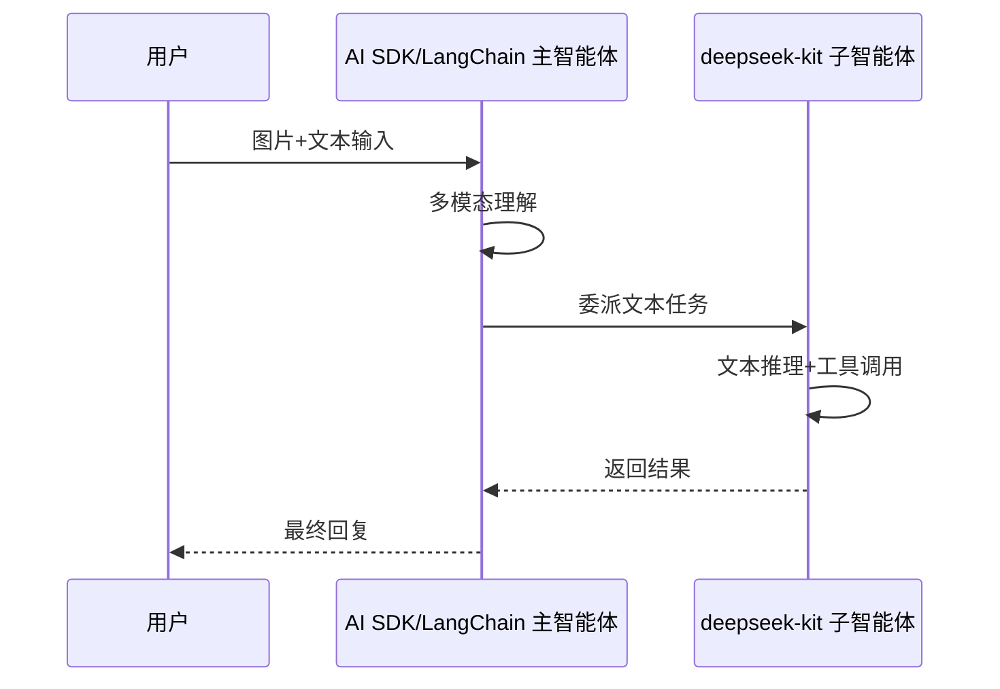
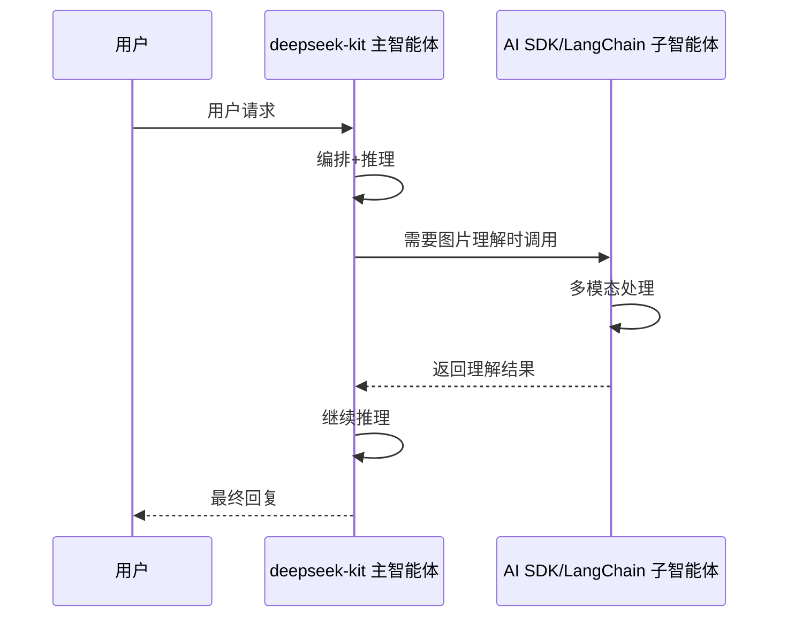

DeepSeek V4 目前不支持多模态输入（图片、音频、文件等），而许多实际应用需要处理图片理解、语音交互等场景。通过将 deepseek-kit 与 AI SDK、LangChain 等支持多模态的框架集成，你可以**让每个框架做它最擅长的事**——deepseek-kit 负责高效的文本推理和工具调用，其他框架负责多模态感知和专有模型调用。

## 为什么需要集成

| 场景 | 说明 |
|------|------|
| **多模态输入** | 用户发送图片、PDF 等多模态内容，需要多模态模型先理解，再交给 DeepSeek 处理 |
| **专有能力互补** | 某些任务需要特定模型的能力（如 OpenAI 的 DALL·E 生成图片、Anthropic 的长文本分析） |
| **渐进式迁移** | 已有 AI SDK 或 LangChain 项目，想逐步引入 DeepSeek 的成本优势 |
| **成本优化** | 简单任务用 DeepSeek Flash，复杂多模态任务用其他模型，按需分配 |

## 两种集成模式

### 模式一：deepseek-kit 作为子智能体

将 deepseek-kit 的智能体封装为工具，嵌入 AI SDK 或 LangChain 的主智能体中。主智能体负责多模态理解和任务分发，DeepSeek 智能体负责文本推理和工具调用：



适用场景：
- 用户输入包含图片、文件等多模态内容
- 主流程需要多模态理解，子任务只需文本处理
- 想在现有 AI SDK/LangChain 项目中引入 DeepSeek

### 模式二：其他框架作为子智能体

将 AI SDK 或 LangChain 的智能体封装为工具，嵌入 deepseek-kit 的主智能体中。DeepSeek 智能体作为编排者，在需要多模态能力时调用其他框架：



适用场景：
- 大部分任务是文本推理，偶尔需要多模态能力
- 想以 deepseek-kit 为主框架，按需调用其他模型
- 利用 DeepSeek 的低成本优势处理主要流量

## 选择建议

| 考虑因素 | deepseek-kit 作为子智能体 | 其他框架作为子智能体 |
|---------|------------------------|-------------------|
| 主框架 | AI SDK / LangChain | deepseek-kit |
| 多模态频率 | 频繁 | 偶尔 |
| 成本控制 | 主框架承担多模态成本 | DeepSeek 处理主要流量，成本更低 |
| 代码组织 | 多模态逻辑在主框架 | 多模态逻辑封装为工具 |
| 迁移成本 | 适合已有项目 | 适合新项目 |

## 安装依赖

根据你选择的集成方式，安装对应的依赖：

```bash
# 与 AI SDK 集成
pnpm add deepseek-kit ai @ai-sdk/openai

# 与 LangChain 集成
pnpm add deepseek-kit langchain @langchain/openai
```

接下来，选择你需要的集成指南：

- [AI SDK 集成](./ai-sdk) — 与 Vercel AI SDK 协同工作
- [LangChain 集成](./langchain) — 与 LangChain.js 协同工作
